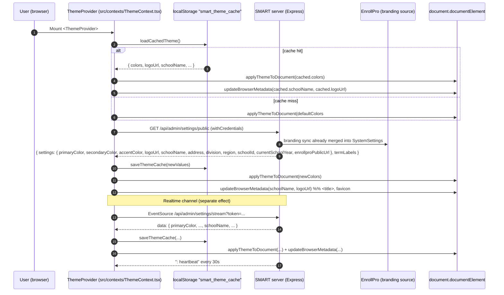

# SMART Design Handoff — EnrollPro, Atlas, AIMS & SORT

> [!IMPORTANT]
> **AI AGENTS AND DEVELOPERS: READ §1.5 BEFORE WRITING ANY CODE.**
> This document serves FOUR systems. Implementing sections that do not apply to your system is a defect, not extra credit.
>
> | You are | Implement | Do NOT implement |
> |---|---|---|
> | **SORT/MRF** | §2 (all), §3, §4, §5.1–§5.2 | — |
> | **ATLAS / AIMS** | §2.3 (variable-name check only), §3, §4, §5.2 | §2.1, §2.2, §2.4, §2.5 — your system already has EnrollPro branding |
> | **EnrollPro** | §2.2, §2.3, §5.1, §5.3 | §3, §4 — SMART's UI is not EnrollPro's UI |
>
> Full routing table and the §2.3 variable-name caveat: **§1.5**. Before generating code, state your scope in one line: `Scope: <system> — sections: <list>`.

> **Document type:** Code-verified design-system and branding-integration contract.
> **Source of truth:** `C:\Users\Sean\Desktop\SMART_FINAL_CAPSTONE` (branch state as audited).
> **Rule applied:** every token, prop, variant and pattern below is extracted from source. Anything absent is marked **NOT IMPLEMENTED**. File paths are relative to the repo root.
>
> Naming note: the task title says "SORT". This repository's Integrated Systems sidebar labels the fourth companion **MRF** — "Maintenance requests" (`src/components/layout/IntegratedSystemsNav.tsx:17`), and the SSO guide calls it MRF throughout (`COMPANION-SSO-INTEGRATION-GUIDE.md` §1). This document uses **SORT/MRF** for that system. No "SORT" string exists in the repo.
>
> **Start here:** §1.5 Per-System Reading Paths. ATLAS/AIMS already have EnrollPro branding — they need §2.3, §3, §4, §5.2. SORT/MRF needs §2 in full plus the UI layer.

---

## 1. Executive Summary

### 1.1 SMART's role in the ecosystem

SMART (Student Management and Records Tracking) is the **academic grading subsystem** of a DepEd public-school (Grades 7–10) multi-system suite. Its functional surface, verified from routes and pages:

- **Grades / class records** — class record ledger (WW/PT/TA categories), quarterly grades, transmutation, grade locking, edit requests (`src/pages/teacher/ClassRecordView.tsx`, `server/src/routes/grades.ts`).
- **Attendance** — taking attendance and reporting (`src/pages/teacher/Attendance.tsx`, `server/src/routes/attendance.ts`).
- **Advisory** — adviser class, student grade profiles (`src/pages/teacher/MyAdvisory.tsx`, `src/pages/teacher/StudentGradeProfile.tsx`).
- **Registrar operations** — student records, section rosters, transferees, remedial tracker, EOSY finalization, alumni, school forms SF1/SF5/SF9/SF10 (`src/pages/registrar/*`, `server/src/routes/registrar.ts`).
- **Administration** — users, class assignments, grading config, school years, system settings/health, audit logs, grade edit requests (`src/pages/admin/*`, `server/src/routes/admin.ts`).

SMART **does not own branding**. It consumes tenant branding produced upstream by EnrollPro.

### 1.2 Ecosystem hierarchy

```
EnrollPro (hub / upstream source of truth)
  ├── tenant branding: colors, logo, school metadata  ──►  GET /api/admin/settings/public + SSE stream
  ├── identity: companion SSO (Flow A launch, Flow B reverse)
  ├── school years / terms / enrollment data (read-only sync)
  └── catalog of companions
        ├── SMART   — grades + attendance            (this repo)
        ├── ATLAS   — teaching loads and schedules
        ├── AIMS    — academic interventions
        └── SORT/MRF — maintenance requests
```

Verified hierarchy signals:

- EnrollPro is described as the hub in `src/components/layout/IntegratedSystemsNav.tsx:24-31` ("EnrollPro is the hub: the item performs a same-tab navigation to EnrollPro's reverse/start endpoint…") and in `COMPANION-SSO-INTEGRATION-GUIDE.md:15` ("EnrollPro is the hub. Today there is no direct companion-to-companion SSO.").
- Branding flows one way: EnrollPro → SMART via `/api/admin/settings/public` (`src/contexts/ThemeContext.tsx:5`), with no write-back anywhere in the client.
- SMART's own admin settings page can *edit* colors locally (`server/src/routes/admin-sub/system.ts:416-442`) but the branding source in practice is EnrollPro's branding sync (`server/src/lib/enrollproBrandingSync.ts:124`, `server/src/lib/enrollproClient.ts:996-999`).

### 1.3 Tech stack (verified from `package.json`, `vite.config.ts`, `components.json`)

| Layer | Technology | Version (package.json) | Key files |
|---|---|---|---|
| Framework | React + TypeScript | react `^19.2.4`, TS `~5.9.3` | `src/App.tsx`, `src/main.tsx`, `tsconfig.app.json` |
| Build | Vite + `@vitejs/plugin-react` | vite `^8.0.1` | `vite.config.ts` |
| Styling | **Tailwind CSS v4** via `@tailwindcss/vite` (no `tailwind.config.*`) | `^4.2.2` | `src/index.css` |
| Component set | shadcn/ui **base-nova** style, CSS-variables mode, built on **Base UI** (`@base-ui/react`) | shadcn `^4.1.1`, base-ui `^1.3.0` | `components.json`, `src/components/ui/` |
| Variants | `class-variance-authority` + `clsx` + `tailwind-merge` | CVA `^0.7.1`, tailwind-merge `^3.5.0` | `src/lib/utils.ts` |
| Animation helpers | `tw-animate-css` | `^1.4.0` | `src/index.css:4` |
| Icons | `lucide-react` | `^1.7.0` | everywhere |
| Toasts | **Sonner** | `^2.0.8` | `src/main.tsx:5,20` |
| Server state | TanStack React Query | `^5.95.2` | `src/main.tsx:9-13`, `src/hooks/useNotifications.ts` |
| Global state | Zustand is a dependency but **NOT USED IN CODE** | declared `^5.0.12` | grep for `zustand` in `src/` → no matches |
| Forms | `react-hook-form` + `@hookform/resolvers` + `zod` are dependencies; **react-hook-form is NOT used in code** (no `useForm` anywhere). Server-side zod is used extensively | `react-hook-form ^7.72.0`, `zod ^4.3.6` | `server/src/schemas/*` |
| Charts | `recharts` | `^3.8.1` | declared; not part of the design-token surface |
| Font | **DM Sans** via Google Fonts (CSS `@import`) | — | `src/index.css:1` |
| Backend | Express 5 + Prisma (PostgreSQL) | — | `server/src/` |
| Branding source | EnrollPro (upstream) → `ThemeContext` → `/api/admin/settings/public` + SSE `/api/admin/settings/stream` | — | `src/contexts/ThemeContext.tsx` |
| Cross-system nav | `IntegratedSystemsNav` (SSO links to EnrollPro; other companions disabled) | — | `src/components/layout/IntegratedSystemsNav.tsx` |

`components.json` (verbatim, abridged to the load-bearing keys):

```json
{
  "style": "base-nova",
  "rsc": false,
  "tsx": true,
  "tailwind": { "config": "", "css": "src/index.css", "baseColor": "neutral", "cssVariables": true, "prefix": "" },
  "iconLibrary": "lucide",
  "aliases": { "components": "@/components", "utils": "@/lib/utils", "ui": "@/components/ui", "lib": "@/lib", "hooks": "@/hooks" }
}
```

Note `"tailwind.config": ""` — **there is no Tailwind config file**; tokens live only in `src/index.css`.

### 1.4 Guiding principles observed in the code

1. **Brand parity** — one ingress (`applyThemeToDocument`) writes both SMART-native variables (`--theme-*`) and EnrollPro-compatible variables (`--primary-color`, `--secondary-color`, `--accent-color`) plus Tailwind overrides (`--primary`, `--color-primary`, `--primary-foreground`, `--ring`), so any subsystem that adopts either naming renders the same brand (`src/contexts/ThemeContext.tsx:73-124`).
2. **Cache-first hydration** — `localStorage["smart_theme_cache"]` is read synchronously in `useState` initializers and applied on mount before network fetch, eliminating a flash of default brand (`src/contexts/ThemeContext.tsx:154-189`).
3. **Federation through EnrollPro, never companion→companion** — sidebar launches `window.location.assign(<EnrollPro>/api/auth/companion-sso/smart/reverse/start)`; the other companion rows are rendered disabled with `aria-label "... — Unavailable until federation"` (`src/components/layout/IntegratedSystemsNav.tsx:36-41,92-104`).
4. **Derived notifications, no shared notification database** — the bell derives alerts from existing role-scoped endpoints (`src/hooks/useNotifications.ts:1-11`); dismissal state is per-user localStorage.
5. **Semantic tokens over raw palette** — declared in `AGENTS.md` ("Banned Patterns") and largely honored, with code-verified exceptions listed in Appendix A.6 (`src/components/ui/select.tsx`, `src/components/ui/tooltip.tsx`, layouts' `#0F1729`/`slate-*` chrome).

### 1.5 Per-System Reading Paths (AI agents: start here)

> **This is the routing section. Do not skip it.** If you are an AI assistant, print your scope line from the table below before producing any code or plan.

ATLAS and AIMS already receive EnrollPro branding (colors + logo). SORT/MRF does not yet. Read accordingly:

| System | Goal | Required reading | Optional / reference |
|---|---|---|---|
| **SORT / MRF** | Branding wiring **and** full UI layer | **`SORT BRANDING HANDOFF.md`** (dedicated end-to-end branding spec) or §2.1–§2.4 (ingestion, schema, variable mapping, cache/fallback), **§2.5** (copy-paste provider), §3 (tokens), §4 (components), §5.1–§5.2 (SSO launch item + header chrome), §4.4 (feedback), §6 | §2.2 if the branding endpoint needs rework, Appendix A for quirks |
| **ATLAS** | UI layer only (branding already present) | **§2.3** (variable-name compatibility bridge — verify your runtime exposes `--primary`, `--color-primary`, `--primary-foreground`, `--ring`, `--theme-primary`), §3 (tokens), §4 (components), §5.2 (header chrome), §4.4 (feedback), §6 (Component Parity / Visual QA) | §2.1–§2.4 as background; §2.5 only if your branding library needs alignment |
| **AIMS** | UI layer only (branding already present) | Same as ATLAS | Same as ATLAS; also see `COMPANION-SSO-INTEGRATION-GUIDE.md` §10 (AIMS is the SSO reference implementation) |
| **EnrollPro** | Contract verification (feeds all companions) | **§2.2** (public settings schema), §2.3 (variable contract SMART consumes), §5.1 (SSO endpoints/error contract), §5.3 (SSE frames) | §3–§4 not applicable (EnrollPro owns branding, not SMART's UI) |

Key nuance for ATLAS/AIMS: if your theme runtime writes only `--primary-color`/`--secondary-color`/`--accent-color` (the EnrollPro-compatible names), SMART's components — which consume `--primary`, `--color-primary`, `--primary-foreground` and Tailwind utilities like `bg-primary`/`text-primary` — will render **unthemed**. §2.3 is the bridge: it lists both naming schemes and stamps them from one source. Add the Tailwind-override block to your runtime and the UI layer copies cleanly.

---

## 2. EnrollPro Branding Pipeline (Contract Specification)

> **Audience:** SORT/MRF — implement in full (§2.5). ATLAS/AIMS — §2.3 only (variable-name compatibility check). EnrollPro — §2.2/§2.3 contract verification. See §1.5.

Entry point: `src/contexts/ThemeContext.tsx` (329 lines). Server counterpart: `server/src/routes/admin-sub/system.ts:111-151` (public read) and `:1006-1023` (SSE stream).

### 2.1 Token Ingestion Flow

Step-by-step narrative (all line references are `src/contexts/ThemeContext.tsx` unless noted):

1. `App` wraps the router in `<ThemeProvider>` (`src/App.tsx:66`).
2. `ThemeProvider` initializes each state slice **from cache**:
   - `useState(() => loadCachedTheme()?.colors ?? defaultColors)` (line 171) and the same cache-first pattern for `logoUrl`, `schoolName`, `schoolAddress`, `schoolDivision`, `schoolRegion`, `schoolId`, `currentSchoolYear` (lines 172-178).
   - `enrollproPublicUrl` initializes from `import.meta.env.VITE_ENROLLPRO_PUBLIC_URL || DEFAULT_ENROLLPRO_PUBLIC_URL` (lines 179-181).
3. Mount effect applies the cached theme synchronously to the document before paint: `applyThemeToDocument(cached?.colors ?? defaultColors)` + `updateBrowserMetadata(...)` (lines 185-189).
4. Mount effect calls `refreshTheme()` (lines 269-271). `refreshTheme` issues `axios.get(SETTINGS_URL, { withCredentials: true })` where `SETTINGS_URL = "/api/admin/settings/public"` (lines 5, 191-195).
5. Response mapping: `settings.primaryColor|secondaryColor|accentColor` → `newColors` with per-field fallback to `defaultColors`; `logoUrl`, `schoolName`, `address`, `division`, `region`, `schoolId`, `currentSchoolYear` mapped with defaults (lines 198-209). `settings.enrollproPublicUrl` is accepted only if truthy, then trailing slashes stripped (lines 219-221).
6. State is updated, cache is persisted via `saveThemeCache({...})` (line 224), then `applyThemeToDocument(newColors)` and `updateBrowserMetadata(newSchoolName, newLogoUrl)` run (lines 227-228).
7. On failure, the catch block re-applies the current in-memory state (`applyThemeToDocument(colors)`) and keeps cached/default values; `finally` sets `loading = false` (lines 229-236).
8. **Real-time channel:** a second mount effect opens an `EventSource` to `/api/admin/settings/stream?token=<portal token>` (lines 274-320). `onmessage` JSON-parses the payload and calls `applySettingsUpdate(...)` which mirrors steps 5–6 but does **not** update `currentSchoolYear` or `enrollproPublicUrl` (lines 240-267). `onopen` resets backoff to 2000 ms; `onerror` closes and reconnects with exponential backoff capped at 30000 ms (lines 298-310).
9. Re-render: every component that calls `useTheme()` (33 files under `src/pages/` alone, plus all three portal layouts, `AppModal`/`InfoCard`/`StatTile`/`StepCards`, and `IntegratedSystemsNav`) re-reads `colors`, `logoUrl`, school metadata. Components that never call `useTheme()` still restyle through CSS because `applyThemeToDocument` mutates `document.documentElement.style`.



### 2.2 API Response Schema

Extracted from `server/src/routes/admin-sub/system.ts:113-151`. The endpoint is **public (no auth)** and explicitly exempted from the global GET rate limiter (`server/src/middleware/rateLimiter.ts:18`).

Success response (200):

```json
{
  "settings": {
    "schoolName": "Bagong Silang National High School",
    "schoolId": "300123",
    "division": "Division of ...",
    "region": "Region IV-A",
    "schoolHeadName": "Juan Dela Cruz",
    "address": "...",
    "primaryColor": "#7f1d1d",
    "secondaryColor": "#991b1b",
    "accentColor": "#b91c1c",
    "logoUrl": "/uploads/school-logo.png",
    "currentSchoolYear": "2026-2027",
    "currentTerm": "T2",
    "termDatesDerived": false,
    "enrollproPublicUrl": "https://dev-jegs.buru-degree.ts.net"
  },
  "termLabels": { "T1": "First Quarter", "T2": "Second Quarter", "T3": "Third Quarter" }
}
```

Empty-database case: `settings` becomes `{ "enrollproPublicUrl": "..." }` only (line 144) and `termLabels` falls back to `{ T1: "Term 1", T2: "Term 2", T3: "Term 3" }` (lines 119-124).

Field provenance and client usage:

| Field | Server source | Consumed by `ThemeContext`? | Notes |
|---|---|---|---|
| `schoolName` | `SystemSettings.schoolName` | yes (line 204) | drives `<title>` and sidebar logo text |
| `schoolId` | `SystemSettings.schoolId` | yes (line 208) | exposed via context; no theme use |
| `division` | `SystemSettings.division` | yes (line 206) | context only |
| `region` | `SystemSettings.region` | yes (line 207) | context only |
| `schoolHeadName` | `SystemSettings.schoolHeadName` | **no** (absent from the client's axios generic, line 193) | returned but unused by ThemeContext |
| `address` | `SystemSettings.address` | yes (line 205) | context only |
| `primaryColor` | `SystemSettings.primaryColor` | yes (line 199) | becomes `colors.primary` |
| `secondaryColor` | `SystemSettings.secondaryColor` | yes (line 200) | becomes `colors.secondary` |
| `accentColor` | `SystemSettings.accentColor` | yes (line 201) | becomes `colors.accent` |
| `logoUrl` | `SystemSettings.logoUrl` | yes (line 203) | favicon + sidebar/auth-page logo (relative URLs are prefixed with `SERVER_URL`, which is `""`) |
| `currentSchoolYear` | `SystemSettings.currentSchoolYear` | yes (line 209) | "S.Y. …" badge in portal headers |
| `currentTerm` | `SystemSettings.currentTerm` | **no** | returned but unused by ThemeContext |
| `termDatesDerived` | `SystemSettings.termDatesDerived` | **no** | returned but unused by ThemeContext |
| `enrollproPublicUrl` | `getEnrollProPublicUrl()` (`server/src/lib/companionSso.ts:68-77`) | yes (lines 219-221) | reverse-SSO launch base, trailing slash stripped |
| `termLabels` | `getActiveTermLabels()` | **no** | consumed by pages/schemas, not ThemeContext |

**Security invariant (verified):** this payload is a whitelist. `sanitizeSettings()` (lines 39-46) deletes `enrollproPassword` and `enrollproIntegrationKey` from every non-public settings response and SSE broadcast; the public route never reads those fields.

Admin-only sibling endpoints (**do not consume these for theming**): `GET /api/admin/settings` (`authenticateToken` + `requireAdmin`, line 153) and `PUT /api/admin/settings` (line 179); `PUT /api/admin/settings/colors` uses `colorSettingsSchema` with `z.string().max(7)` per color (`server/src/schemas/admin.ts:95`, `server/src/routes/admin-sub/system.ts:416-432`).

### 2.3 CSS Variable Mapping Table

Every `root.style.setProperty()` call in `applyThemeToDocument` (`src/contexts/ThemeContext.tsx:73-124`), in execution order:

| EnrollPro API field | CSS variable(s) set | Value | Tailwind utility affected | UI purpose |
|---|---|---|---|---|
| `primaryColor` | `--theme-primary` | raw color | (arbitrary `[var(--theme-primary)]`) | SMART-native brand var (sidebar active pill, logo fallback) |
| `secondaryColor` | `--theme-secondary` | raw color | `[var(--theme-secondary)]` | SMART-native secondary |
| `accentColor` | `--theme-accent` | raw color | `[var(--theme-accent)]` | SMART-native accent |
| all three | `--primary-color`, `--secondary-color`, `--accent-color` | raw colors | legacy `var(--*-color)` | EnrollPro-compatible naming |
| `primaryColor` | `--text-color` | `#1f2937` if primary light else `#ffffff` | legacy | EnrollPro text-on-brand |
| — (constant) | `--bg-color` | `#f8fafc` | legacy | EnrollPro page background |
| `primaryColor` | `--theme-primary-light` / `--theme-primary-dark` | `adjustColor(primary, +40 / -40)` | arbitrary | hover/active shades |
| `secondaryColor` | `--theme-secondary-light` / `--theme-secondary-dark` | `adjustColor(secondary, ±40)` | arbitrary | hover/active shades |
| `primaryColor` | `--primary-light` / `--primary-dark` | `adjustColor(primary, ±40)` | arbitrary | legacy alias pair |
| `primaryColor` | `--theme-primary-text`, `--text-primary`, `--on-primary` | contrast text (`#1f2937`/`#ffffff`) | arbitrary | readable text on primary |
| `secondaryColor` | `--theme-secondary-text`, `--text-secondary`, `--on-secondary` | contrast text | arbitrary | readable text on secondary |
| `primaryColor` | `--primary` | raw color | `bg-primary`, `text-primary`, `border-primary`, `from-primary`, … | **the** Tailwind semantic override |
| `primaryColor` | `--color-primary` | raw color | same set (v4 `@theme inline` alias) | explicit v4 override |
| primary contrast | `--primary-foreground` | `#1f2937`/`#ffffff` | `text-primary-foreground` | readable on `bg-primary` |
| primary contrast | `--color-primary-foreground` | same | same set | v4 alias |
| `primaryColor` | `--ring` / `--color-ring` | raw color | `ring-ring`, `focus-visible:ring-ring/50`, `:focus-visible{outline}` | focus rings |
| all three | `--theme-primary-rgb`, `--theme-secondary-rgb`, `--theme-accent-rgb` | `"r, g, b"` | `rgba(var(--theme-primary-rgb), α)` | gradients/opacity (PixelGridBackground) |
| `primaryColor` | `--primary-rgb` | `"r, g, b"` | `rgba(var(--primary-rgb), α)` | legacy RGB |
| `primaryColor` | `--chart-1` | raw color | recharts / `fill-chart-1` | chart series 1 follows brand |

Contrast helpers: `isLightColor()` uses perceived luminance `(0.299R + 0.587G + 0.114B)/255 > 0.5` (lines 55-62); `adjustColor()` clamps each channel to `[0,255]` after adding a signed offset (lines 65-71).

`applyThemeToDocument` in full (copy this verbatim into any subsystem):

```ts
// Helper function to determine if a color is light or dark
function isLightColor(hexColor: string): boolean {
  const hex = hexColor.replace("#", "");
  const r = parseInt(hex.substring(0, 2), 16);
  const g = parseInt(hex.substring(2, 4), 16);
  const b = parseInt(hex.substring(4, 6), 16);
  const luminance = (0.299 * r + 0.587 * g + 0.114 * b) / 255;
  return luminance > 0.5;
}

// Helper function to lighten or darken a color
function adjustColor(hexColor: string, amount: number): string {
  const hex = hexColor.replace("#", "");
  const r = Math.min(255, Math.max(0, parseInt(hex.substring(0, 2), 16) + amount));
  const g = Math.min(255, Math.max(0, parseInt(hex.substring(2, 4), 16) + amount));
  const b = Math.min(255, Math.max(0, parseInt(hex.substring(4, 6), 16) + amount));
  return `#${r.toString(16).padStart(2, "0")}${g.toString(16).padStart(2, "0")}${b.toString(16).padStart(2, "0")}`;
}

function applyThemeToDocument(colors: ThemeColors) {
  const root = document.documentElement;

  // Set primary theme variables (SMART specific)
  root.style.setProperty("--theme-primary", colors.primary);
  root.style.setProperty("--theme-secondary", colors.secondary);
  root.style.setProperty("--theme-accent", colors.accent);

  // Set EnrollPro compatible variables
  root.style.setProperty("--primary-color", colors.primary);
  root.style.setProperty("--secondary-color", colors.secondary);
  root.style.setProperty("--accent-color", colors.accent);
  root.style.setProperty("--text-color", isLightColor(colors.primary) ? "#1f2937" : "#ffffff");
  root.style.setProperty("--bg-color", "#f8fafc");

  // Generate color variations
  root.style.setProperty("--theme-primary-light", adjustColor(colors.primary, 40));
  root.style.setProperty("--theme-primary-dark", adjustColor(colors.primary, -40));
  root.style.setProperty("--theme-secondary-light", adjustColor(colors.secondary, 40));
  root.style.setProperty("--theme-secondary-dark", adjustColor(colors.secondary, -40));
  root.style.setProperty("--primary-light", adjustColor(colors.primary, 40));
  root.style.setProperty("--primary-dark", adjustColor(colors.primary, -40));

  // Text color for buttons (white or black based on background)
  const primaryTextColor = isLightColor(colors.primary) ? "#1f2937" : "#ffffff";
  const secondaryTextColor = isLightColor(colors.secondary) ? "#1f2937" : "#ffffff";
  root.style.setProperty("--theme-primary-text", primaryTextColor);
  root.style.setProperty("--theme-secondary-text", secondaryTextColor);
  root.style.setProperty("--text-primary", primaryTextColor);
  root.style.setProperty("--text-secondary", secondaryTextColor);
  root.style.setProperty("--on-primary", primaryTextColor);
  root.style.setProperty("--on-secondary", secondaryTextColor);

  // Sync Tailwind --primary so bg-primary, text-primary, border-primary reflect branding
  root.style.setProperty("--primary", colors.primary);
  root.style.setProperty("--color-primary", colors.primary);
  root.style.setProperty("--primary-foreground", primaryTextColor);
  root.style.setProperty("--color-primary-foreground", primaryTextColor);
  root.style.setProperty("--ring", colors.primary);
  root.style.setProperty("--color-ring", colors.primary);

  // RGB values for gradient/opacity uses
  const hexToRgb = (hex: string) => {
    const h = hex.replace("#", "");
    return `${parseInt(h.substring(0, 2), 16)}, ${parseInt(h.substring(2, 4), 16)}, ${parseInt(h.substring(4, 6), 16)}`;
  };
  root.style.setProperty("--theme-primary-rgb", hexToRgb(colors.primary));
  root.style.setProperty("--theme-secondary-rgb", hexToRgb(colors.secondary));
  root.style.setProperty("--theme-accent-rgb", hexToRgb(colors.accent));
  root.style.setProperty("--primary-rgb", hexToRgb(colors.primary));
  root.style.setProperty("--chart-1", colors.primary);
}
```

Runtime behavior notes (verified):

- Inline styles on `document.documentElement` beat the stylesheet's `:root` and `.dark` declarations, so **the tenant primary overrides dark-mode `--primary` too**.
- `adjustColor` is integer-channel arithmetic (not perceptual), so `±40` shifts are naive.
- Only `--chart-1` is rewired; `--chart-2..5` remain the static palette.

### 2.4 Fallback & Caching Strategy

**Default colors** (`src/contexts/ThemeContext.tsx:28-32`):

```ts
const defaultColors: ThemeColors = {
  primary: "#10b981",   // emerald-500
  secondary: "#34d399", // emerald-400
  accent: "#6ee7b7",    // emerald-300
};
```

**Default EnrollPro origin** (lines 3, 34, 179-181):

```ts
const DEFAULT_ENROLLPRO_PUBLIC_URL = "https://dev-jegs.buru-degree.ts.net";
// client: import.meta.env.VITE_ENROLLPRO_PUBLIC_URL || DEFAULT_ENROLLPRO_PUBLIC_URL
```

Server-side origin resolution (`server/src/lib/companionSso.ts:68-77`): `ENROLLPRO_PUBLIC_URL` if set; else `ENROLLPRO_BASE_URL || ENROLLPRO_URL || "https://dev-jegs.buru-degree.ts.net/api"` with a trailing `/api` stripped.

**Cache contract:**

| Item | Value |
|---|---|
| Key | `smart_theme_cache` (`src/contexts/ThemeContext.tsx:154`) |
| Storage | `localStorage` |
| Shape | `{ colors: {primary,secondary,accent}, logoUrl: string\|null, schoolName, schoolAddress, schoolDivision, schoolRegion, schoolId, currentSchoolYear? }` |
| Writers | `saveThemeCache()` after successful `refreshTheme` (line 224) and after SSE `applySettingsUpdate` (line 262) |
| Readers | `loadCachedTheme()` in eight `useState` initializers (lines 171-178) and in the pre-paint mount effect (lines 185-189) |
| Failure mode | `try/catch` swallows quota/parse errors; returns `null` (lines 156-168) |

**Hydration behavior — cache-first, network-update:**

1. First paint uses cache (or `defaultColors`).
2. `refreshTheme` fetches the live tenant values.
3. On success, cache is overwritten and the DOM is re-themed.
4. On failure, the catch block *re-applies current state* so the UI never regresses to defaults while a valid cached/loaded theme exists (lines 229-233).
5. SSE keeps long-lived tabs in sync with EnrollPro-driven settings changes without reload.

**Browser metadata** (`updateBrowserMetadata`, lines 126-148`):

```ts
if (schoolName && schoolName !== "School Management System") {
  document.title = `${schoolName} | SMART`;
} else {
  document.title = "SMART - Academic Grading System";
}
if (logoUrl) {
  const fullLogoUrl = logoUrl.startsWith("http") ? logoUrl : `${window.location.origin}${logoUrl}`;
  let link: HTMLLinkElement | null = document.querySelector("link[rel*='icon']");
  if (!link) { link = document.createElement('link'); link.rel = 'icon'; document.getElementsByTagName('head')[0].appendChild(link); }
  link.href = fullLogoUrl;
  link.type = "image/x-icon";
}
```

If `logoUrl` is null, the pre-existing favicon is left untouched (no negative branch exists).

### 2.5 Replication Guide for Atlas, AIMS & SORT

> **Primary consumer: SORT/MRF** (no branding yet). ATLAS/AIMS: skip unless you need to reconcile variable names — use §2.3 instead.

Copy-pasteable integration for a companion subsystem. The only per-system change is the title suffix and (optionally) the storage key.

```ts
// ---------------------------------------------------------------------------
// 1. Constants — replace "ATLAS" with your system name ("AIMS", "SORT", ...)
// ---------------------------------------------------------------------------
import axios from "axios";
import { createContext, useContext, useState, useEffect, type ReactNode } from "react";

const SYSTEM_NAME = "ATLAS";                          // <-- per system
const SETTINGS_URL = "/api/admin/settings/public";    // same on every SMART-family server
const THEME_CACHE_KEY = "smart_theme_cache";          // keep the shared key, or scope it: "atlas_theme_cache"
const DEFAULT_ENROLLPRO_PUBLIC_URL = "https://dev-jegs.buru-degree.ts.net";

interface ThemeColors { primary: string; secondary: string; accent: string }
const defaultColors: ThemeColors = { primary: "#10b981", secondary: "#34d399", accent: "#6ee7b7" };
```

```ts
// ---------------------------------------------------------------------------
// 2. Full applyThemeToDocument() — copy the function from §2.3 verbatim.
//    It is system-agnostic: it only writes CSS custom properties.
// ---------------------------------------------------------------------------

// ---------------------------------------------------------------------------
// 3. Browser metadata
// ---------------------------------------------------------------------------
function updateBrowserMetadata(schoolName: string, logoUrl: string | null, systemName: string) {
  if (schoolName && schoolName !== "School Management System") {
    document.title = `${schoolName} | ${systemName}`;
  } else {
    document.title = `${systemName} - Academic System`;
  }
  if (logoUrl) {
    const fullLogoUrl = logoUrl.startsWith("http") ? logoUrl : `${window.location.origin}${logoUrl}`;
    let link: HTMLLinkElement | null = document.querySelector("link[rel*='icon']");
    if (!link) {
      link = document.createElement("link");
      link.rel = "icon";
      document.getElementsByTagName("head")[0].appendChild(link);
    }
    link.href = fullLogoUrl;
    link.type = "image/x-icon";
  }
}
```

```ts
// ---------------------------------------------------------------------------
// 4. Cache helpers (identical shape to SMART so shared tooling/tests keep working)
// ---------------------------------------------------------------------------
function loadCachedTheme(): any | null {
  try { const c = localStorage.getItem(THEME_CACHE_KEY); return c ? JSON.parse(c) : null; } catch { return null; }
}
function saveThemeCache(data: unknown) {
  try { localStorage.setItem(THEME_CACHE_KEY, JSON.stringify(data)); } catch { /* best-effort */ }
}
```

```ts
// ---------------------------------------------------------------------------
// 5. Provider — cache-first, network-update, SSE live updates
// ---------------------------------------------------------------------------
export function ThemeProvider({ children }: { children: ReactNode }) {
  const [colors, setColors] = useState<ThemeColors>(() => loadCachedTheme()?.colors ?? defaultColors);
  const [logoUrl, setLogoUrl] = useState<string | null>(() => loadCachedTheme()?.logoUrl ?? null);
  const [schoolName, setSchoolName] = useState(() => loadCachedTheme()?.schoolName ?? "School Management System");
  const [enrollproPublicUrl, setEnrollproPublicUrl] = useState(
    () => (import.meta as any).env.VITE_ENROLLPRO_PUBLIC_URL || DEFAULT_ENROLLPRO_PUBLIC_URL,
  );

  // 5a. Apply cache before first paint
  useEffect(() => {
    const cached = loadCachedTheme();
    applyThemeToDocument(cached?.colors ?? defaultColors);
    updateBrowserMetadata(cached?.schoolName ?? schoolName, cached?.logoUrl ?? logoUrl, SYSTEM_NAME);
    // eslint-disable-next-line react-hooks/exhaustive-deps
  }, []);

  // 5b. Fetch + cache + apply
  const refreshTheme = async () => {
    try {
      const { data } = await axios.get<{ settings: Record<string, string | undefined> }>(SETTINGS_URL, {
        withCredentials: true,
      });
      const s = data.settings;
      const newColors: ThemeColors = {
        primary: s.primaryColor || defaultColors.primary,
        secondary: s.secondaryColor || defaultColors.secondary,
        accent: s.accentColor || defaultColors.accent,
      };
      const newLogoUrl = s.logoUrl || null;
      const newSchoolName = s.schoolName || "School Management System";
      setColors(newColors); setLogoUrl(newLogoUrl); setSchoolName(newSchoolName);
      if (s.enrollproPublicUrl) setEnrollproPublicUrl(s.enrollproPublicUrl.replace(/\/+$/, ""));
      saveThemeCache({
        colors: newColors, logoUrl: newLogoUrl, schoolName: newSchoolName,
        schoolAddress: s.address || "", schoolDivision: s.division || "",
        schoolRegion: s.region || "", schoolId: s.schoolId || "",
        currentSchoolYear: s.currentSchoolYear || "",
      });
      applyThemeToDocument(newColors);
      updateBrowserMetadata(newSchoolName, newLogoUrl, SYSTEM_NAME);
    } catch {
      applyThemeToDocument(colors);                       // keep cached/current brand
      updateBrowserMetadata(schoolName, logoUrl, SYSTEM_NAME);
    }
  };

  useEffect(() => { refreshTheme(); /* eslint-disable-next-line */ }, []);

  // 5c. Live updates (same channel SMART uses; token query param because EventSource cannot set headers)
  useEffect(() => {
    const token = sessionStorage.getItem("token_" + (location.pathname.split("/")[1] || "teacher"));
    if (!token) return;
    let es: EventSource | null = null;
    let backoff = 2000;
    let timer: ReturnType<typeof setTimeout> | null = null;
    const connect = () => {
      es = new EventSource(`/api/admin/settings/stream?token=${encodeURIComponent(token)}`);
      es.onmessage = (e) => {
        try {
          const s = JSON.parse(e.data);
          const newColors: ThemeColors = {
            primary: s.primaryColor || defaultColors.primary,
            secondary: s.secondaryColor || defaultColors.secondary,
            accent: s.accentColor || defaultColors.accent,
          };
          setColors(newColors);
          applyThemeToDocument(newColors);
          saveThemeCache({ colors: newColors, logoUrl: s.logoUrl || null, schoolName: s.schoolName || "School Management System" });
        } catch { /* ignore malformed frame */ }
      };
      es.onopen = () => { backoff = 2000; };
      es.onerror = () => { es?.close(); timer = setTimeout(() => { backoff = Math.min(backoff * 2, 30000); connect(); }, backoff); };
    };
    connect();
    return () => { if (timer) clearTimeout(timer); es?.close(); };
  }, []);

  return (
    <ThemeCtx.Provider value={{ colors, logoUrl, schoolName, enrollproPublicUrl }}>
      {children}
    </ThemeCtx.Provider>
  );
}
```

**Replication rules (derived from SMART):**

1. Serve the same `:root` token block from §3.1; `applyThemeToDocument` writes variables that only exist once the block is present.
2. Keep `--primary`/`--color-primary`/`--primary-foreground`/`--ring` overridden at runtime; SMART's Tailwind v4 `@theme inline` mapping (`src/index.css:418-458`) resolves utilities through these variables.
3. Do not read colors from a Tailwind config — there is none.
4. Keep `withCredentials: true` on the settings GET (cookie session) and send the portal token as a query param on SSE (`server/src/middleware/auth.ts:22-26` accepts header, `?token=`, or `accessToken` cookie).
5. Never cache-miss to "no theme": always fall back to `#10b981/#34d399/#6ee7b7`.
6. Write metadata updates on both cache hydration and network refresh (no flash of unstyled/named chrome).

---

## 3. Design Tokens (The Foundation)

> **Audience:** all subsystems (ATLAS, AIMS, SORT) — copy directly. This is the shared visual foundation.

All static tokens live in **`src/index.css`** (658 lines). There is **no `tailwind.config.js` / `.ts`** (confirmed by `components.json` `"config": ""` and repo-wide glob). `src/App.css` exists but is **not imported anywhere** (grep for `App.css` in `src/` returns no matches) — treat it as dead legacy CSS; its tokens are listed in Appendix A.5.

Import order (`src/index.css:1-7`):

```css
@import url('https://fonts.googleapis.com/css2?family=DM+Sans:ital,opsz,wght@0,9..40,100..1000;1,9..40,100..1000&display=swap');
@import "tailwindcss";
@import "tw-animate-css";
@import "shadcn/tailwind.css";
@custom-variant dark (&:is(.dark *));
```

### 3.1 Color System

#### 3.1.1 Dynamic tokens (injected at runtime by `ThemeContext`)

See §2.3 for the full mapping. Values are tenant-supplied hex; defaults `#10b981 / #34d399 / #6ee7b7`.

#### 3.1.2 Static shadcn semantic tokens — `:root` (`src/index.css:64-123`)

Hex equivalents computed from the OKLCH values (OKLab→linear-sRGB→sRGB, gamut-clamped where noted; `(clamped)` means one channel fell outside sRGB and was clipped, which is expected for the vivid v4 palette).

| Token | OKLCH (source) | Hex equivalent | Notes |
|---|---|---|---|
| `--background` | `oklch(0.99 0 0)` | `#fcfcfc` | page background |
| `--foreground` | `oklch(0.145 0 0)` | `#0a0a0a` | default text |
| `--card` | `oklch(1 0 0)` | `#ffffff` | card surface |
| `--card-foreground` | `oklch(0.145 0 0)` | `#0a0a0a` | card text |
| `--popover` | `oklch(1 0 0)` | `#ffffff` | menus/dialogs |
| `--popover-foreground` | `oklch(0.145 0 0)` | `#0a0a0a` | menu text |
| `--primary` | `oklch(0.696 0.17 162.48)` | `#00bc7d (clamped)` | **overridden at runtime** by tenant primary |
| `--primary-foreground` | `oklch(0.985 0 0)` | `#fafafa` | **overridden** by computed contrast |
| `--secondary` | `oklch(0.97 0.005 240)` | `#f2f6f8` | secondary surfaces |
| `--secondary-foreground` | `oklch(0.205 0 0)` | `#171717` | |
| `--muted` | `oklch(0.97 0 0)` | `#f5f5f5` | muted backgrounds, card headers |
| `--muted-foreground` | `oklch(0.48 0 0)` | `#5d5d5d` | secondary text |
| `--accent` | `oklch(0.97 0 0)` | `#f5f5f5` | hover surface (see dark-mode conflict, §3.1.4) |
| `--accent-foreground` | `oklch(0.205 0 0)` | `#171717` | |
| `--destructive` | `oklch(0.577 0.245 27.325)` | `#e7000b (clamped)` | destructive actions |
| `--input` | `oklch(0.93 0 0)` | `#e8e8e8` | input borders |
| `--ring` | `oklch(0.696 0.17 162.48)` | `#00bc7d (clamped)` | **overridden** by tenant primary |
| `--chart-1` | `oklch(0.696 0.17 162.48)` | `#00bc7d (clamped)` | **overridden** by tenant primary |
| `--chart-2` | `oklch(0.6 0.2 250)` | `#0081f1 (clamped)` | |
| `--chart-3` | `oklch(0.65 0.18 310)` | `#b16ae0` | |
| `--chart-4` | `oklch(0.7 0.18 50)` | `#f37513` | |
| `--chart-5` | `oklch(0.55 0.2 200)` | `#008f9f (clamped)` | |
| `--radius` | `0.75rem` | — | see §3.4 |
| `--sidebar` | `oklch(0.99 0 0)` | `#fcfcfc` | |
| `--sidebar-foreground` | `oklch(0.145 0 0)` | `#0a0a0a` | |
| `--sidebar-primary` | `oklch(0.696 0.17 162.48)` | `#00bc7d (clamped)` | |
| `--sidebar-primary-foreground` | `oklch(0.985 0 0)` | `#fafafa` | |
| `--sidebar-accent` | `oklch(0.97 0.01 165)` | `#eff7f3` | |
| `--sidebar-accent-foreground` | `oklch(0.205 0 0)` | `#171717` | |
| `--sidebar-border` | `oklch(0.935 0 0)` | `#e9e9e9` | |
| `--sidebar-ring` | `oklch(0.696 0.17 162.48)` | `#00bc7d (clamped)` | |

Additional legacy `:root` values that are still referenced by components/CSS (`src/index.css:11-19`): `--text:#64748b`, `--text-h:#0f172a`, `--bg:#fafbfc`, `--border:oklch(0.922 0 0 / 65%)` (`#e5e5e5` at 65% alpha), `--code-bg:#f1f5f9`, `--accent-bg:rgba(16,185,129,0.08)`, `--accent-border:rgba(16,185,129,0.4)`, `--social-bg:rgba(241,245,249,0.8)`.

Note: `--border` is declared **only** in the legacy block; `@theme inline` maps `--color-border: var(--border)` (`src/index.css:435`), so `border-border` uses the 65%-alpha line above.

#### 3.1.3 Ledger category tokens (domain-specific, sanctioned exception)

Defined in `:root` (`src/index.css:34-44`) and overridden in `.dark` (`:509-519`). Usage is sanctioned only for the class-record ledger (`AGENTS.md` → "Ledger Category Tokens").

| Token | Light | Dark |
|---|---|---|
| `--ledger-ww` | `#4f46e5` | `#818cf8` |
| `--ledger-ww-bg` | `#eef2ff` | `rgba(99, 102, 241, 0.15)` |
| `--ledger-pt` | `#9333ea` | `#c084fc` |
| `--ledger-pt-bg` | `#faf5ff` | `rgba(168, 85, 247, 0.15)` |
| `--ledger-ta` | `#d97706` | `#fbbf24` |
| `--ledger-ta-bg` | `#fffbeb` | `rgba(245, 158, 11, 0.15)` |
| `--ledger-grade` | `#059669` | `#34d399` |
| `--ledger-grade-bg` | `#ecfdf5` | `rgba(16, 185, 129, 0.15)` |
| `--ledger-aims` | `#0e7490` | `#22d3ee` |
| `--ledger-aims-bg` | `#ecfeff` | `rgba(6, 182, 212, 0.15)` |

#### 3.1.4 Dark mode — `.dark` (`src/index.css:460-520`)

| Token | OKLCH (source) | Hex equivalent |
|---|---|---|
| `--background` | `oklch(0.145 0 0)` | `#0a0a0a` |
| `--foreground` | `oklch(0.985 0 0)` | `#fafafa` |
| `--card` / `--popover` | `oklch(0.205 0 0)` | `#171717` |
| `--card-foreground` / `--popover-foreground` | `oklch(0.985 0 0)` | `#fafafa` |
| `--primary` | `oklch(0.922 0 0)` | `#e5e5e5` (still overridden at runtime by tenant primary) |
| `--primary-foreground` | `oklch(0.205 0 0)` | `#171717` (still overridden at runtime) |
| `--secondary` / `--muted` / `--accent` (tokens) | `oklch(0.269 0 0)` | `#262626` |
| `--secondary-foreground` / `--accent-foreground` | `oklch(0.985 0 0)` | `#fafafa` |
| `--muted-foreground` | `oklch(0.708 0 0)` | `#a1a1a1` |
| `--destructive` | `oklch(0.704 0.191 22.216)` | `#ff6467 (clamped)` |
| `--border` | `oklch(1 0 0 / 10%)` | `#ffffff` at 10% alpha |
| `--input` | `oklch(1 0 0 / 15%)` | `#ffffff` at 15% alpha |
| `--ring` | `oklch(0.556 0 0)` | `#737373` (runtime override still applies) |
| `--chart-1..5` | `0.87 / 0.556 / 0.439 / 0.371 / 0.269` grayscale | `#d4d4d4 / #737373 / #525252 / #404040 / #262626` |
| `--sidebar` | `oklch(0.205 0 0)` | `#171717` |
| `--sidebar-primary` | `oklch(0.488 0.243 264.376)` | `#1447e6` |
| `--sidebar-accent` | `oklch(0.269 0 0)` | `#262626` |
| `--sidebar-border` | `oklch(1 0 0 / 10%)` | `#ffffff` at 10% alpha |
| `--sidebar-ring` | `oklch(0.556 0 0)` | `#737373` |

Then the legacy palette re-declares (`src/index.css:493-507`): `--text:#94a3b8`, `--text-h:#f1f5f9`, `--bg:#0f172a`, `--code-bg:#1e293b`, `--accent-bg:rgba(52,211,153,0.12)`, `--accent-border:rgba(52,211,153,0.4)`, `--social-bg:rgba(30,41,59,0.8)`, and darker `--shadow-xs…--shadow-xl`, `--shadow-emerald`.

**Code-verified dark-mode quirk (important):** `.dark` sets `--accent` twice — `oklch(0.269 0 0)` at line 473 and `#34d399` at line 498. The later declaration wins, so in dark mode `bg-accent` is **emerald-300**, not a dark gray. Any subsystem copying the block should either delete the legacy `--accent:#34d399` line or rename it (`--accent-legacy`) to preserve the intended dark hover surface.

#### 3.1.5 Alpha / placeholder conventions

- Placeholder text uses `placeholder:text-muted-foreground` in `input.tsx`/`textarea.tsx`.
- Destructive tints: `bg-destructive/10` (badges, alert tiles), `bg-destructive/20` dark.
- Muted header bands: `bg-muted/50` (card headers/footers, table head rows, dialog footers).
- Focus rings: `focus-visible:ring-3 focus-visible:ring-ring/50` (buttons/inputs) and global `:focus-visible { outline: 2px solid var(--ring); outline-offset: 2px; }` (`src/index.css:413-416`; also `src/App.css:172-175` but that file is unused).

### 3.2 Typography

**Font stacks** (`src/index.css:46-47`, `419`):

```css
--sans: 'DM Sans', system-ui, -apple-system, sans-serif;
--mono: 'SF Mono', ui-monospace, Consolas, monospace;
@theme inline { --font-sans: 'DM Sans', sans-serif; }
```

Root typography (`:root` block, lines 49-58): `font: 16px/1.6 var(--sans)`; `letter-spacing: -0.011em`; `font-synthesis: none`; `text-rendering: optimizeLegibility`; antialiasing on; `font-feature-settings: 'cv02','cv03','cv04','cv11'`; `color-scheme: light`. Under `max-width: 640px` the root font size drops to `15px` (lines 60-62).

**Heading scale** (`src/index.css:149-168`):

| Element | Size | Weight | Letter-spacing | Line-height |
|---|---|---|---|---|
| `h1` | `clamp(1.875rem, 4vw, 2.5rem)` | 700 | `-0.03em` | 1.25 (inherited from h1–h6 rule) |
| `h2` | `clamp(1.25rem, 2.5vw, 1.5rem)` | 600 | `-0.025em` | 1.25 |
| `h3` | `clamp(1.125rem, 2vw, 1.25rem)` | 600 | `-0.025em` | 1.25 |
| `h4`–`h6` | browser default (no size override) | 600 | `-0.025em` | 1.25 |
| `p` | inherited (`1rem`, 15px mobile) | 400 | `-0.011em` | 1.7 |
| `code`, `.counter` | `0.875em` | 400 | — | — (inline-flex, radius 6px, padding `.25em .5em`, `--code-bg`) |

**Application type scale** (design convention from `AGENTS.md` → "Type Scale", verified in components):

| Role | Classes | Example file |
|---|---|---|
| Page title | `text-2xl font-bold tracking-tight text-foreground` | `src/components/layout/PageHeader.tsx:27` |
| Page subtitle | `text-sm text-muted-foreground` | `PageHeader.tsx:34` |
| Card/section title | `text-base font-semibold text-foreground` | `src/components/ui/card.tsx:50-57` |
| Card description | `text-xs tracking-wide font-medium text-muted-foreground uppercase` | `card.tsx:68-69` |
| Table header | `text-xs font-medium uppercase tracking-wide text-muted-foreground` | `src/components/ui/table.tsx:71` (`DataTable` uses `text-[11px] font-semibold … tracking-wider`, `src/components/data-table/DataTable.tsx:34-35`) |
| Table cell | `text-sm text-foreground` | `DataTable.tsx:36-37` |
| Stat label / value | `text-xs font-medium text-muted-foreground` / `text-2xl font-bold text-foreground` | `src/components/layout/StatCard.tsx:44-45` |

Monospace usage is limited to `code`/`.counter` (`src/index.css:175-187`) and tabular numerals (`tabular-nums` in `AppModal` `StatTile`, `SyncProgressModal`, `GradeDeadlineBanner`).

### 3.3 Elevation & Depth

**Shadow ladder** (`:root`, `src/index.css:22-32`):

| Token | Light value | Dark value (`:502-507`) |
|---|---|---|
| `--shadow-xs` | `0 1px 2px rgba(0,0,0,0.04)` | `0 1px 2px rgba(0,0,0,0.2)` |
| `--shadow-sm` | `0 2px 4px rgba(0,0,0,0.04), 0 1px 2px rgba(0,0,0,0.06)` | `0 2px 4px rgba(0,0,0,0.2)` |
| `--shadow-md` | `0 4px 6px -1px rgba(0,0,0,0.05), 0 2px 4px -1px rgba(0,0,0,0.04)` | `0 4px 6px -1px rgba(0,0,0,0.25)` |
| `--shadow-lg` | `0 10px 15px -3px rgba(0,0,0,0.06), 0 4px 6px -2px rgba(0,0,0,0.04)` | `0 10px 15px -3px rgba(0,0,0,0.3)` |
| `--shadow-xl` | `0 20px 25px -5px rgba(0,0,0,0.06), 0 10px 10px -5px rgba(0,0,0,0.03)` | `0 20px 25px -5px rgba(0,0,0,0.35)` |
| `--shadow-2xl` | `0 25px 50px -12px rgba(0,0,0,0.15)` | not overridden (reuses light) |
| `--shadow-glow` | `0 0 40px rgba(16,185,129,0.15)` | not overridden |
| `--shadow-emerald` | `0 10px 30px -5px rgba(16,185,129,0.25)` | `0 10px 30px -5px rgba(16,185,129,0.35)` |
| `--shadow-emerald-sm` | `0 4px 14px -3px rgba(16,185,129,0.2)` | not overridden |

Code-verified usage facts:

- The `--shadow-*` custom properties are **defined but never consumed by class name or `var()` in `src/`** (grep for `shadow-emerald`/`shadow-glow` finds only the definitions). Component elevation is expressed with Tailwind utilities instead: `Card` uses an inline arbitrary shadow `shadow-[0_2px_8px_-3px_rgba(0,0,0,0.06),0_10px_22px_-6px_rgba(0,0,0,0.04)]` (`src/components/ui/card.tsx:17`); `StatCard` uses `shadow-lg shadow-muted/50` (`StatCard.tsx:37`); dialogs/menus use `shadow-md`/`shadow-lg`/`shadow-2xl`.
- Component-level hover elevation: `.card-hover:hover { transform: translateY(-4px); box-shadow: var(--shadow-xl); }` (`src/index.css:364-367`).

**z-index conventions** (extracted from component classes):

| Layer | z-index | Evidence |
|---|---|---|
| Full-page pixel backdrop | `-z-10` | `src/components/layout/PixelGridBackground.tsx:9` |
| In-card badges | `z-10` | `src/components/ui/avatar.tsx:62`, `src/components/ui/select.tsx:153` |
| Sticky portal header | `z-30` | `src/layouts/TeacherLayout.tsx:318`, `AdminLayout.tsx:516`, `RegistrarLayout.tsx:340` |
| Mobile sidebar backdrop | `z-40` | `TeacherLayout.tsx:153`, `AdminLayout.tsx:181`, `RegistrarLayout.tsx:148` |
| Sidebar, dropdown menus, selects, dialogs | `z-50` (`isolate`) | `TeacherLayout.tsx:161`, `src/components/ui/dropdown-menu.tsx:37,45`, `select.tsx:144,149`, `dialog.tsx:32,54` |
| Blocking progress modal | `z-[100]` | `src/components/common/SyncProgressModal.tsx:64` |

### 3.4 Spacing, Radius & Layout

**Radius scale** (`src/index.css:451-457`), computed from `--radius: 0.75rem`:

| Utility token | Formula | Computed |
|---|---|---|
| `--radius-sm` | `calc(var(--radius) * 0.6)` | `0.45rem` (7.2px) |
| `--radius-md` | `calc(var(--radius) * 0.8)` | `0.6rem` (9.6px) |
| `--radius-lg` | `var(--radius)` | `0.75rem` (12px) |
| `--radius-xl` | `calc(var(--radius) * 1.4)` | `1.05rem` (16.8px) |
| `--radius-2xl` | `calc(var(--radius) * 1.8)` | `1.35rem` (21.6px) |
| `--radius-3xl` | `calc(var(--radius) * 2.2)` | `1.65rem` (26.4px) |
| `--radius-4xl` | `calc(var(--radius) * 2.6)` | `1.95rem` (31.2px) |

Observed application (verified):

- Buttons: `rounded-lg` (default height 32px `h-8`); `Button` includes `rounded-[min(var(--radius-md),10px)]` for `xs` and `[min(var(--radius-md),12px)]` for `sm` (`src/components/ui/button.tsx:25-32`).
- Cards: `rounded-xl` (`card.tsx:15`); `DataTable` wrapper `rounded-xl` (`DataTable.tsx:62`).
- Modals: `rounded-xl` (dialog) → `rounded-xl sm:rounded-2xl` (`src/components/app-modal/index.tsx:79`); `SyncProgressModal` `rounded-2xl`.
- Badges: `rounded-4xl` (`badge.tsx:8`).
- Sidebar nav pills: `rounded-full` (`TeacherLayout.tsx:240`).
- Inputs: `rounded-lg` (`input.tsx:12`).

**Layout scaffolding** (AGENTS.md convention + verified components):

- Page root: `space-y-6` (banned: `space-y-8`).
- Table container: `Card` with `p-0` + `overflow-x-auto` (`DataTable.tsx:62,78-79`).
- Max content width: `.page-container { max-width: 1440px; margin: 0 auto; padding: 0 1.5rem; }` exists only in the **unused** `src/App.css:4-8`; real pages use `main.p-4 lg:p-8` (`TeacherLayout.tsx:383`).

**Breakpoints:** Tailwind v4 defaults are used (no overrides). Evidence: `sm:` (640px) / `lg:` (1024px) variants across `PageHeader`, `dialog.tsx`, layouts (`lg:pl-[280px]`, `lg:hidden`, `lg:translate-x-0`); one CSS media query at `max-width: 640px` for root font size (`src/index.css:60-62`); the JS sidebar toggle branches on `window.innerWidth >= 1024` (`TeacherLayout.tsx:324`).

**Grid patterns:** App modal `StepCards` uses `grid grid-cols-1 sm:grid-cols-3 gap-3` (`app-modal/index.tsx:233`); dashboards use `lg:col-span-2` grids (`src/pages/admin/Dashboard.tsx:362`); `DataTable` header uses `flex flex-col lg:flex-row` (`DataTable.tsx:64`).

**Print layout tokens** (`src/index.css:530-658`):

- `.sf9-print-container { display: none }` on screen; revealed only during SF9 printing.
- `@media print`: `body` white + `print-color-adjust: exact`; `.print-hide{display:none}`; `.print-form` (2px black border, 10mm padding, no shadow); `.print-form-sf9` uses `@page sf9-portrait` (A4 portrait, 10mm 8mm margins) with forced `.sf9-page-break` before core values; `.print-form table` fixed layout 11px; `.page-break-inside-avoid`; SF1 `@page` legal landscape 10mm margin (`.sf1-print-area` 9px).
- Print typography overrides force `#111827` headings and `color: inherit` for body elements (lines 634-650). Note the print block still references banned `bg-gray-*` class names in selectors (`.print-form .bg-gray-200/.bg-gray-100/.bg-gray-50`, lines 609-615) for legacy form markup.

### 3.5 Animation Tokens

`tw-animate-css` is imported (`src/index.css:4`) and supplies the `animate-in / fade-in-0 / zoom-in-95 / slide-in-from-*` utilities used by Base UI components (`dialog.tsx`, `dropdown-menu.tsx`, `select.tsx`, `tabs.tsx`).

**Keyframes defined in `src/index.css`:**

| Keyframe | Definition | Applied via |
|---|---|---|
| `fadeIn` | opacity 0→1 | `.animate-fade-in { animation: fadeIn .4s ease-out forwards }` (line 264) |
| `slideUp` | opacity 0 + translateY(20px) → 0 | `.animate-slide-up { .5s ease-out forwards }` (line 276) |
| `slideInRight` | opacity 0 + translateX(20px) → 0 | `.animate-slide-in-right { .4s ease-out forwards }` (line 280) |
| `scaleIn` | opacity 0 + scale(.95) → 1 | `.animate-scale-in { .3s ease-out forwards }` (line 284) |
| `float` | translateY 0→-8px→0 | `.animate-float { 4s ease-in-out infinite }` (line 288) |
| `pulse-glow` | box-shadow emerald 20px→40px | **defined, no utility class / NOT REFERENCED** (lines 233-240) |
| `shimmer` | background-position -200%→200% | **defined, no utility class / NOT REFERENCED** (lines 242-245) |
| `gradient-shift` | background-position 0%→100%→0% | `.animate-gradient { 8s ease infinite; background-size:200% 200% }` (line 292) |
| `pulse-subtle` | opacity 1→.9 + scale 1→.998 | `.animate-pulse-subtle { 3s ease-in-out infinite }` (line 272) |
| `spin-slow` | rotate 0→360 | `.animate-spin-slow { 8s linear infinite }` (line 268) |
| `login-gradient-shift` | same as gradient-shift | `.animate-login-gradient { 14s ease infinite }` (line 313) |
| `login-float` | translateY 0→-16px→0 | `.animate-login-float { 9s ease-in-out infinite }` (line 318) |
| `login-scale-in` | opacity 0 + scale(.98) → 1 | `.animate-login-scale-in { 220ms ease-out forwards }` (line 322) |
| `skeleton-loading` (App.css) | gradient sweep | `.skeleton` — **unused file** (App.css:126-136) |

Verified call sites for the active utilities: `.animate-fade-in` (`GradeDeadlineBanner.tsx:43,169,199,223`), `.animate-slide-up` (`ClassRecordsList.tsx:123`, `Attendance.tsx:471`), `.animate-pulse-subtle` / `.animate-spin-slow` / `.animate-float` / `.animate-gradient` / `.animate-login-*` — login/landing pages. `prefers-reduced-motion` is only honored programmatically by `useCountUp` (`src/hooks/useCountUp.ts:11-24`); no global `motion-reduce` CSS reset exists.

---

## 4. Component Catalog

> **Audience:** all subsystems (ATLAS, AIMS, SORT) — this is the UI parity target.

### 4.1 shadcn/ui Primitives (`src/components/ui/`) — 18 files

All primitives are style `base-nova` built on **Base UI** (`@base-ui/react`), not Radix. Every component carries `data-slot` attributes for styling hooks. "Brand tokens" below = variables that ThemeContext overrides.

| # | File | Exports | Variants / Sizes (CVA or documented props) | Brand-token consumption | A11y attributes |
|---|---|---|---|---|---|
| 1 | `src/components/ui/button.tsx` | `Button`, `buttonVariants` | `variant`: `default` (bg-primary), `outline`, `secondary`, `ghost`, `destructive` (tinted `bg-destructive/10 text-destructive`), `link`. `size`: `default` (h-8), `xs` (h-6), `sm` (h-7), `lg` (h-9), `icon`/`icon-xs`/`icon-sm`/`icon-lg`. Base: `inline-flex … rounded-lg border … text-sm font-medium … focus-visible:ring-3 focus-visible:ring-ring/50 … aria-invalid:*` | `bg-primary`, `text-primary-foreground`, `ring` (runtime-overridden); `destructive` token | native `<button>` semantics; `aria-invalid` styling; focus-visible ring; disabled opacity |
| 2 | `src/components/ui/card.tsx` | `Card`, `CardHeader`, `CardTitle`, `CardDescription`, `CardAction`, `CardContent`, `CardFooter` | `Card size`: `default` \| `sm` (denser padding via group-data) | `bg-card`, `text-card-foreground`, `bg-muted/50`, `border-border` | `data-slot` only; no ARIA roles (layout) |
| 3 | `src/components/ui/badge.tsx` | `Badge`, `badgeVariants` | `variant`: `default` (bg-primary), `secondary`, `destructive`, `outline`, `ghost`, `link`. Fixed `h-5`, `rounded-4xl`, `text-xs font-medium` | `bg-primary text-primary-foreground`, `bg-destructive/10 text-destructive` | `aria-invalid` styling; `[&>svg]:size-3`; focus ring |
| 4 | `src/components/ui/input.tsx` | `Input` | none; `h-8 rounded-lg border-input`, `text-base md:text-sm`, file-input styles | `border-input`, `ring`, `aria-invalid:border-destructive` | native input; `aria-invalid` styling; `disabled:*` |
| 5 | `src/components/ui/textarea.tsx` | `Textarea` | none; `min-h-16 rounded-lg px-3 py-2` | `border-input`, `ring` | `aria-invalid`, `disabled` |
| 6 | `src/components/ui/select.tsx` | `Select`, `SelectTrigger`, `SelectContent`, `SelectItem`, `SelectGroup`, `SelectLabel`, `SelectValue`, `SelectSeparator`, `SelectScrollUpButton`, `SelectScrollDownButton` | `SelectTrigger size`: `sm` (h-8) \| `default` (h-10); `SelectContent` props `side`, `sideOffset`, `align`, `alignOffset`, `alignItemWithTrigger`, `searchable` (auto-enabled when item count > 6, line 134); built-in search input | **Raw palette** (`border-zinc-200`, `text-zinc-800`, `focus:ring-blue-500`, `focus:bg-blue-500`, `bg-white`) — does not follow tenant brand; see Appendix A.6 | Base UI positioning; `data-placeholder`, `data-disabled`, `aria-expanded` hooks; search input is unlabeled (`placeholder="Search"`) |
| 7 | `src/components/ui/dialog.tsx` | `Dialog`, `DialogTrigger`, `DialogPortal`, `DialogClose`, `DialogOverlay`, `DialogContent`, `DialogHeader`, `DialogFooter`, `DialogTitle`, `DialogDescription` | `DialogContent showCloseButton` (default true); `DialogFooter showCloseButton` (default false); overlay `z-50 bg-black/10 supports-backdrop-filter:backdrop-blur-xs`; content `rounded-xl sm:max-w-sm`, open/close `animate-in/out` | `bg-popover`, `text-popover-foreground`, `ring-foreground/10`, `bg-muted/50` footer, close button uses `Button ghost` | Base UI focus trap/escape; `DialogTitle`/`Description` semantic parts; close button has `sr-only` "Close" |
| 8 | `src/components/ui/table.tsx` | `Table`, `TableHeader`, `TableBody`, `TableFooter`, `TableRow`, `TableHead`, `TableCell`, `TableCaption` | none; head `h-11 px-4 py-3 text-xs uppercase tracking-wide text-muted-foreground`; row `hover:bg-muted/50`, `data-[state=selected]:bg-muted` | `bg-muted/50`, `text-muted-foreground`, `border-border` | real `<table>` semantics; `[&:has([role=checkbox])]` support |
| 9 | `src/components/ui/tabs.tsx` | `Tabs`, `TabsList`, `TabsTrigger`, `TabsContent`, `tabsListVariants` | `TabsList variant`: `default` (bg-muted pill) \| `line` (underline via `after:` pseudo); orientation horizontal/vertical | `bg-muted`, `bg-background`, `text-muted-foreground/foreground`, `ring` | Base UI tablist/tab/panel roles; `data-active`, `aria-disabled` handling |
| 10 | `src/components/ui/tooltip.tsx` | `Tooltip`, `HelpTooltip` | Props: `children`, `content`, `side` (`top`\|`bottom`\|`left`\|`right`, default top), `className`. Custom implementation (no Base UI) | **None** — hardcoded `bg-gray-900 text-white` (banned palette; see Appendix A.6) | `role="tooltip"`; shows on mouseenter/focus, hides on mouseleave/blur; HelpTooltip button has `aria-label="Help"` |
| 11 | `src/components/ui/label.tsx` | `Label` | none | semantic text tokens only | native `<label>`; `peer-disabled`/`group-data-[disabled=true]` styling |
| 12 | `src/components/ui/checkbox.tsx` | `Checkbox` | none; native `<input type="checkbox">` `h-4 w-4 rounded accent-primary` | `accent-primary`, `ring`, `border-input` | native checkbox semantics |
| 13 | `src/components/ui/dropdown-menu.tsx` | `DropdownMenu`, `DropdownMenuTrigger` (supports `render`), `DropdownMenuContent`, `DropdownMenuGroup`, `DropdownMenuLabel`, `DropdownMenuItem` (`variant: default\|destructive`), `DropdownMenuCheckboxItem`, `DropdownMenuRadioGroup`, `DropdownMenuRadioItem`, `DropdownMenuSeparator`, `DropdownMenuShortcut`, `DropdownMenuSub`, `DropdownMenuSubTrigger`, `DropdownMenuSubContent`, `DropdownMenuPortal` | Container defaults `align=start`, `side=bottom`, `sideOffset=4`; submenu `side=right`, `alignOffset=-3` | `bg-popover`, `text-popover-foreground`, `focus:bg-accent`, `text-destructive`, `ring-foreground/10` | Base UI menu roving focus; `data-disabled`, `data-inset`, `data-variant` hooks |
| 14 | `src/components/ui/avatar.tsx` | `Avatar`, `AvatarImage`, `AvatarFallback`, `AvatarBadge`, `AvatarGroup`, `AvatarGroupCount` | `Avatar size`: `default` (size-8) \| `sm` (size-6) \| `lg` (size-10) | `bg-muted`, `bg-primary` (badge), `ring-background` | image alt via consumer; fallback text |
| 15 | `src/components/ui/pagination.tsx` | `Pagination` (legacy) | Props: `currentPage`, `totalPages`, `onPageChange`, `totalItems?`, `itemsPerPage=10`, `className?`, `showItemCount=true`. Hides when `totalPages <= 1` | Active page button `bg-primary` | `sr-only` labels on all four arrow buttons ("First page", "Previous page", …) |
| 16 | `src/components/ui/scroll-area.tsx` | `ScrollArea`, `ScrollBar` | `ScrollBar orientation` vertical (default) \| horizontal; 2.5-unit thickness | `bg-border` thumb | Base UI scrollarea; `focus-visible` ring on viewport |
| 17 | `src/components/ui/separator.tsx` | `Separator` | `orientation`: horizontal (default) \| vertical | `bg-border` | Base UI separator (adds `role="separator"` semantics) |
| 18 | `src/components/ui/skeleton.tsx` | `Skeleton` | none; `animate-pulse rounded-md bg-muted` | `bg-muted` | `data-slot`; presentational |

Two pagination implementations exist and should not be confused: the legacy `ui/pagination.tsx` (raw `currentPage` API) and the canonical `data-table/TablePagination.tsx` (used by `DataTable`, hides when `totalRows <= 10`).

### 4.2 Layout Components (`src/components/layout/`)

| Component | File | Props | Brand integration | Notes |
|---|---|---|---|---|
| `PageHeader` | `PageHeader.tsx` | `title: string`, `description?: string`, `actions?: ReactNode`, `badge?: ReactNode`, `className?: string` | semantic tokens only; description hidden below `sm` | Canonical page title block; badge renders inline next to `<h1>` |
| `SearchInput` | `SearchInput.tsx` | `value`, `onChange(value)`, `placeholder="Search..."`, `className?`, `inputClassName?`, `inputRef?` | semantic tokens; inset `Search` icon `w-3.5 h-3.5 text-muted-foreground` | Canonical search box; input `pl-8 h-9 w-56 rounded-lg text-xs` |
| `StatCard` | `StatCard.tsx` | `label: string`, `value: ReactNode`, `numericValue?: number`, `icon?`, `iconClassName?`, `trend?: { value: string; direction: "up"\|"down"\|"neutral"; hint?: string }`, `className?` | consumes `Card`, semantic tokens; trend `up` = `text-emerald-600`, `down` = `text-red-600` (raw palette, intentional signal colors) | Uses `useCountUp(numericValue, 800ms)`; animates only when `numericValue` provided; respects `prefers-reduced-motion` (`useCountUp.ts:11-24`) |
| `NotificationBell` | `NotificationBell.tsx` | `portal: PortalRole`, `userId: string \| null`, `atlasOffline?: boolean`, `enrollproOffline?: boolean` | `bg-destructive` badge, `text-primary` dismiss-all link, severity colors `text-destructive`/`text-amber-600`/`text-muted-foreground` | Returns `null` when `userId` is null; dropdown `w-80 p-0`, empty state "You're all caught up", badge caps at `9+`; dismissal delegates to `useNotifications` |
| `IntegratedSystemsNav` | `IntegratedSystemsNav.tsx` | `collapsed: boolean` | `--theme-primary` indirectly via parent; hardcoded text `#0F1729` (EnrollPro slate) | Companion list `AIMS, SMART, ATLAS, MRF` (`COMPANIONS`, lines 13-18); EnrollPro enabled item navigates same tab to `${enrollproPublicUrl}/api/auth/companion-sso/smart/reverse/start` with `window.location.assign` (lines 36-42); other companions rendered as non-interactive `div` with `opacity-40 cursor-not-allowed` and `aria-label "... — Unavailable until federation"` (lines 96-104); collapsible label animation `transition-[opacity,transform,margin] duration-200 ease-[cubic-bezier(0.4,0,0.2,1)]` |
| `PixelGridBackground` | `PixelGridBackground.tsx` | none | `backgroundImage: linear-gradient(to bottom right, #f8fafc 0%, rgba(var(--theme-primary-rgb), .08) 50%, rgba(var(--theme-primary-rgb), .06) 100%)`; SVG `#app-pixel-grid` 80×80 pattern of four 36×36 rounded rects stroked with `var(--theme-primary)` at `opacity-[0.08]` | `aria-hidden="true"`; `pointer-events-none fixed inset-0 -z-10`; explicitly documented as mirroring EnrollPro's `login-pixel-grid` |
| `PageError` | `PageError.tsx` | `title="Something went wrong"`, `message: string`, `onRetry?`, `retryLabel="Try Again"`, `icon?` | `bg-destructive/10` circle, `text-destructive` icon, outline retry button | Canonical route-level error block, `h-64` centered |

Portal layouts (`src/layouts/`) are catalogued in §5.2.

### 4.3 Domain Components

**Data table system (`src/components/data-table/`)** — 8 files:

| File | Purpose | Key API |
|---|---|---|
| `DataTable.tsx` | Generic `<T>` table: card shell, header band + toolbar, loading/error/empty switching, pagination footer. Head class `text-[11px] font-semibold uppercase tracking-wider`, cell `py-3.5 px-4 text-sm whitespace-nowrap`; rows `hover:bg-muted/50`, `cursor-pointer` when `onRowClick` | `columns: TableColumn<T>[]`, `rows`, `loading?`, `error?`, `title?`, `description?`, `emptyTitle?`, `emptyHint?`, `emptySearchTerm?`, `rowKey(row)`, `onRowClick?`, `toolbar?`, `pagination`, `onRetry?` |
| `types.ts` | `TableColumn<T>` = `{ key, header, cell(row), className?, align?: "left"\|"center"\|"right", skeleton?: SkeletonHint }`; `SkeletonHint = "name"\|"pill"\|"badge"\|"number"\|"date"\|"avatar"`; `TableFilter = { label, value, onChange, options[] }` | type-only |
| `TableToolbar.tsx` | Search + filters + actions row. Controlled (`searchValue`+`onSearchChange`) or uncontrolled (internal state) | `searchPlaceholder="Search..."`, `searchValue?`, `onSearchChange?`, `filters?: TableFilter[]`, `actions?: ReactNode` |
| `TablePagination.tsx` | Canonical pagination footer; item range text, "Rows per page:" select, first/prev/page-numbers/next/last; hides entirely when `totalRows <= 10` | `page`, `totalPages`, `totalRows`, `rowsPerPage`, `onPageChange`, `onRowsPerPageChange` |
| `TableStates.tsx` | `LoadingSkeleton` (6–10 rows, hint-shaped skeletons, opacity 0.6), `EmptyState` (search-aware title `No results for "term"`, Inbox icon), `ErrorState` (destructive circle, message, Retry button) | all render inside `<TableRow><TableCell colSpan>` |
| `usePagination.ts` | 1-based pagination hook; clamps page; resets to page 1 on rows-per-page change | `usePagination({ totalRows, initialRowsPerPage = 10 })` → `{ page, totalPages, rowsPerPage, totalRows, setPage, setRowsPerPage, slice }`; exports `ROWS_PER_PAGE_OPTIONS = [10, 25, 50, 100]`, `DEFAULT_ROWS_PER_PAGE = 10` |
| `Dash.tsx` | Em-dash placeholder for empty cells (`text-muted-foreground/40`) | `<Dash />` |
| `index.ts` | Barrel export | — |

**`ExcelRenderer.tsx`** — pixel-perfect renderer for parsed Excel templates (school forms). Consumes `ParsedSheet` (cells with style/merge metadata, column widths, row heights), props `sheet`, `className`, `scale = 1`, `showGridlines = true`. Styles are read from `./ExcelRenderer.css`. This is intentionally outside the token system because output must match DepEd Excel templates.

**`GradeDeadlineBanner.tsx`** — teacher grading deadline banner. Props `deadline?: GradeDeadlineInfo | null`, `hideLink?: boolean`. Urgency branches, all fed by `urgencyLevel` (`'none' | 'warn' | 'urgent' | 'critical' | 'overdue'`, `src/lib/api.ts:297-304`):

| Variant | Trigger | Visual | Behavior |
|---|---|---|---|
| `overdue` | `urgencyLevel === "overdue"` | `bg-red-50/90 border-red-200/80`, `FileWarning`, `{daysOverdue}d overdue` chip | Collapsible (`expanded` state) with per-class progress bars (`gradedCount/totalStudents`), "Contact Admin" chip, "Open Records" link to `/teacher/classes` |
| `warn` | `"warn"` | `bg-amber-50/90 border-amber-200/80`, `Clock` | Dismissible; `Submit` button |
| `urgent` | `"urgent"` | `bg-orange-50/90 border-orange-200/80`, `AlertTriangle` | "Submit Now" with arrow nudge animation |
| `critical` | `"critical"` | `bg-rose-50/90 border-rose-200/80`, `Siren` with `animate-pulse` | "grades due TODAY / TOMORROW" |
| — | no `deadline`, `!hasIncompleteClasses`, or (`dismissed` and `warn`) | renders `null` | Dismissal persisted in `sessionStorage` under `gradeDeadlineDismissed_{term}_{endDate:YYYY-MM-DD}` (line 20, 124-132); **only `warn` is dismissible**; overdue/urgent/critical reappear |
| All | — | shared `animate-fade-in` | dates formatted `en-PH` long form |

**`GradeStatusBanner.tsx`** — per-term grade lock/deadline status strip, `React.memo`. Props: `currentTerm`, `selectedTerm?`, `termEndDate?`, `gradeLock: boolean`, `colors: { primary: string }` (accepted but unused for colors in render), `editRequestStatus?: "idle"|"pending"|"approved"|"rejected"`, `editTimeRemaining?`, `onRequestEdit?`, `termLabels?`, `termDatesDerived?`, `locks?: { systemLocked, yearLocked, yearLockedBy?, yearLockedAt?, termLocks: {T1,T2,T3} } | null`, `variant?: "card" | "flush"` (card = `rounded-lg border … px-3 py-1.5 mb-3`; flush = `border-t … px-6 py-2.5` for the merged header card).

Decision order (lines 70-235): `hardLocked = systemLocked || yearLocked` (fallback `gradeLock`) → derived-dates info (blue) → system/year lock (red, with "locked by/at" provenance) → approved edit request (emerald with pulsing dot + countdown) → pending request (amber) → past term read-only (slate) + "Request Access" → current term locked (red) → deadline ladder: ≤3 days red, ≤7 amber, ≤14 emerald, >14 `null` → term ended amber ("grades editable until locked").

**`app-modal/index.tsx`** — role-agnostic modal design system (the registrar modal language generalized):

- `AppModal` props: `open`, `onOpenChange`, `icon: ReactNode`, `title`, `description?`, `size?: ModalSize` (`sm`→`sm:!max-w-md`, `md`→`sm:!max-w-2xl`, `lg`→`sm:!max-w-2xl md:!max-w-3xl`, `xl`→`sm:!max-w-3xl md:!max-w-4xl lg:!max-w-5xl`), `confirmLabel="Confirm"`, `onConfirm?`, `confirmDisabled?`, `destructive?`, `loading?`, `hideFooter?`, `children?`.
- Icon tile and confirm button use **inline tenant color**: `style={{ backgroundColor: destructive ? "#dc2626" : colors.primary }}` (lines 86, 118-122) — a sanctioned `useTheme()` consumer (the only place inline color styles are allowed).
- Helpers: `InfoCard` (tone `primary|secondary|accent`, `${color}0A` tint), `StatTile` (tone, `${color}08` bg + `${color}30` border, `tabular-nums`), `AlertBanner` (`danger` red / `warning` amber / `info` blue static config), `StepCards` (numbered 3-up grid, tones cycle `primary,secondary,accent`), `ModalSection` (2px-border section wrapper with title/badge).
- `RegistrarModal`/`RegistrarModalProps` alias exported; `src/components/registrar-modal/index.tsx` is a one-line re-export (`export * from "@/components/app-modal"`).

**`common/ConfirmDialog.tsx`** — thin wrapper over `AppModal`: props `open`, `onOpenChange`, `title`, `description?`, `confirmLabel="Confirm"`, `onConfirm`, `destructive=false`, `loading=false`, `icon?`, `children?`; default icon `AlertTriangle` (destructive) / `CheckCircle2` otherwise; `size="sm"`.

**`common/SyncProgressModal.tsx`** — full-screen `z-[100]` progress modal. Props: `isOpen`, `onClose`, `title="Syncing with EnrollPro"`, `subtitle`, `status: "idle"|"syncing"|"success"|"error"`, `errorMessage?`, `stats?: { updated?, created? }`. Behavior: fixed 3-step narrative advanced by timers 0/1200/2800 ms during `syncing`; auto-dismiss 1200 ms after `success`; backdrop click closes only when not syncing; error footer "Close". Visual states documented in-code (pulsing rings + spinning `CloudDownload`, `CheckCircle2` success, `AlertTriangle` error).

### 4.4 Feedback & Messaging

| System | Library/Component | Trigger API | Configuration (verified) |
|---|---|---|---|
| Toasts | **Sonner** | `toast.success`, `toast.error`, `toast.info` (80+ call-site matches across pages, including the import line; e.g. `src/pages/registrar/Transferees.tsx`, `src/pages/admin/components/GradeLockSection.tsx`) | `<Toaster richColors position="top-right" />` in `src/main.tsx:20` (NOT `App.tsx`). No `duration` prop is set anywhere → Sonner default `TOAST_LIFETIME = 4000` ms (`node_modules/sonner/dist/index.mjs:470`). No `theme` prop → Sonner default theme (system). `toast.promise`, `toast.loading`, `toast.custom`, `toast.dismiss`, `toast.message` are **NOT IMPLEMENTED** (repo-wide grep: zero matches) |
| Banners | `GradeDeadlineBanner`, `GradeStatusBanner` | Server-driven props (see §4.3) | Deadline dismiss key `gradeDeadlineDismissed_{term}_{date}` in `sessionStorage` (warn only); status banner is never dismissible (lock states must remain visible) |
| Notifications | `useNotifications` + `NotificationBell` | Hook-derived; **polling** React Query every `POLL_MS = 60_000` with `staleTime: POLL_MS`, `retry: 0` (`src/hooks/useNotifications.ts:22,77-114`). Offline flags arrive through the layout's single SSE connection (`useSyncStream`) | Endpoints per role in §5.3. Dismissals persist per portal+user in `localStorage` key `smart_notif_dismissed_{portal}_{userId}` (`src/lib/notifications.ts:22-25`). `NotificationBell` renders `null` without `userId`; unread count = active notification count; badge caps at `9+`; empty state "You're all caught up"; clicking an item dismisses then navigates to `href` |
| Loading | `Skeleton`, `LoadingSkeleton`, `PageLoader` (`src/App.tsx:56-62`), `AdminLayout` full-page spinner (`AdminLayout.tsx:160-169`), `SyncProgressModal` | — | Skeleton: `animate-pulse rounded-md bg-muted`; table skeleton 6–10 rows with hint shapes; route Suspense fallback spinner `border-t-emerald-500` on `bg-slate-50` (raw palette in `PageLoader`/`AdminLayout` — see Appendix A.6) |
| Errors | `PageError` (route/page level), `ErrorState` (inside tables), `SsoErrorPage`, inline `aria-invalid` styling on controls | — | **No React error boundary exists anywhere in `src/` (NOT IMPLEMENTED).** Errors surface through React Query error states mapped to `PageError`/`ErrorState`, plus the SPA 404 route (`src/App.tsx:126-137`) |

---

## 5. Cross-System Interoperability

> **Audience:** §5.1 — SORT/MRF (launch item wiring); all systems if SSO needs reconciliation. §5.2 — all subsystems (header/chrome parity). §5.3 — reference for integrators (EnrollPro contract verification).

### 5.1 SSO & Navigation Flow

Two flows, both implemented on both sides (SMART client + `server/src/routes/sso.ts`):

**Flow A — EnrollPro launches SMART:**

1. User clicks SMART in EnrollPro's sidebar → EnrollPro `POST /api/auth/companion-sso/smart/launch` returns `{ launchUrl, expiresAt }`.
2. Browser lands on `GET /api/auth/enrollpro/callback?code=<43-char>&state=…` (`server/src/routes/sso.ts:68-132`). SMART validates code shape (`^[A-Za-z0-9_-]{43}$`, `server/src/lib/companionSso.ts:24`), claims it once in-process (`processedCodes` map, TTL 5 min, lines 36-49), exchanges server-to-server with the outbound secret, maps the identity to a SMART user, sets a short-lived `accessToken` cookie, writes an audit log (`AuditAction.LOGIN`, success/failure), and 302s to `/auth/enrollpro/session`. Errors redirect to `/auth/enrollpro/error?code=<stable-code>`.
3. SPA page `SsoSessionPage` (`src/pages/auth/SsoSessionPage.tsx`) POSTs `/api/auth/enrollpro/session` with credentials; the server issues a fresh access token + refresh-token pair; the SPA writes role-scoped sessionStorage keys and legacy keys, sets `smart_active_portal`, and `window.location.replace()`s to `/admin`, `/registrar`, or `/teacher` (lines 44-58).

**Flow B — SMART launches EnrollPro (reverse):**

1. `IntegratedSystemsNav` navigates the same tab to `<enrollproPublicUrl>/api/auth/companion-sso/smart/reverse/start` (`IntegratedSystemsNav.tsx:36-41`).
2. EnrollPro sets a signed state cookie and 302s to `/auth/enrollpro/authorize?response_type=code&client_id=enrollpro&redirect_uri=<EP reverse callback>&state=…` (alias `/auth/sso/authorize` also routed, `src/App.tsx:79`).
3. `EnrollProAuthorizePage` (`src/pages/auth/EnrollProAuthorizePage.tsx`) reads the four query params, picks the active portal session (`smart_active_portal` hint, then `token_{portal}`+`user_{portal}`), and if no session exists redirects to `/login?returnUrl=<full authorize URL>` (preserving the request — pitfall #4 from the SSO guide, guarded here at lines 64-69).
4. With a session it POSTs `/api/auth/sso/authorize` with the bearer token; the server issues a one-time code (SHA-256 at rest, 60 s TTL, single use, audience+redirect bound) and returns `{ redirectUrl }`; the browser is handed back to EnrollPro with `window.location.assign(response.data.redirectUrl)` (lines 71-82). 401/403 also routes through `/login?returnUrl=…`.
5. EnrollPro's backend calls `POST /api/auth/sso/exchange` with `Authorization: Bearer <reverse secret>` and `{ code, clientId, redirectUri }`; SMART validates with constant-time compare, consumes the code atomically, and returns the identity assertion (`server/src/routes/sso.ts:225-255`). Invalid codes get the exact EnrollPro-expected JSON shape (lines 246-252).

Route mounts (`server/src/index.ts:79-85`): `/api/auth`, `/auth`, `/api/v1/auth` all mount `ssoRoutes` (alias compatibility). Rate limits: `ssoAuthorizeLimiter`, `ssoExchangeLimiter` (`server/src/routes/sso.ts:32`).

**`getPortalToken()` utility** (`src/lib/api.ts:34-36`): `sessionStorage.getItem(getTokenKey())`, where `getTokenKey()` resolves `token_{role}` from the URL prefix (`/admin` → `admin`, `/registrar` → `registrar`, else `teacher`, lines 13-28). Used by the Axios request interceptor (line 61), `ThemeContext` SSE, `useSyncStream`, and `useTemplate`.

**Environment variable:** client `VITE_ENROLLPRO_PUBLIC_URL` (fallback constant `https://dev-jegs.buru-degree.ts.net`, `src/contexts/ThemeContext.tsx:34,180`); server `ENROLLPRO_PUBLIC_URL` / `ENROLLPRO_BASE_URL` / `ENROLLPRO_URL` (`server/src/lib/companionSso.ts:68-77`). The server value is delivered to clients inside `/api/admin/settings/public`.

**Error UX:** stable codes → plain messages via `plainSsoMessage()` (`src/lib/ssoMessages.ts`); `SsoErrorPage` renders them. Codes are the contract; messages are never parsed.

### 5.2 Shared Header Contract

All three portals replicate the same chrome (verified by reading all three layout files). Frozen spec for any subsystem that wants visual parity:

| Element | Spec | Evidence |
|---|---|---|
| Root wrapper | `isolate min-h-screen`, `<PixelGridBackground />` first child | `TeacherLayout.tsx:148-149`, `AdminLayout.tsx:176-177`, `RegistrarLayout.tsx` |
| Sidebar | `fixed inset-y-0 left-0 z-50 bg-[#fafafa] border-r border-slate-200 shadow-sm`; width `280px`, collapsed `70px` (`lg:` only); mobile hidden via `-translate-x-full lg:translate-x-0`; toggle persisted per portal in `localStorage` (`teacherSidebarCollapsed` / `adminSidebarCollapsed` / `registrarSidebarCollapsed`) | `TeacherLayout.tsx:159-165,98-102` |
| Logo block | `h-24` row; logo tile `w-12 h-12 rounded-lg bg-white border border-slate-100 shadow-sm p-1`; fallback icon (`GraduationCap` teacher, `Shield` admin, `FileText` registrar) tinted `text-[var(--theme-primary)]`; school name `font-bold text-sm uppercase text-[var(--theme-primary)] max-w-[160px]` | `TeacherLayout.tsx:168-207` |
| Nav groups | Uppercase micro-label `text-[0.625rem] font-bold text-[#0F1729]/60 tracking-normal` (hidden when collapsed) | `TeacherLayout.tsx:219-224` |
| Nav item | Pill `rounded-full text-[14px] font-medium py-1.5 px-4`; active: `backgroundColor: var(--theme-primary)` + `text-white shadow-sm`; inactive `text-[#0F1729] hover:bg-white/80`; icon `w-5 h-5` `strokeWidth={2.2}`; collapse animation `transition-[opacity,transform,margin] duration-200` | `TeacherLayout.tsx:236-266` |
| `IntegratedSystemsNav` | Rendered after primary groups, inside nav | `TeacherLayout.tsx:273`, `AdminLayout.tsx:471`, `RegistrarLayout.tsx` |
| Profile footer | `p-4 border-t border-slate-100 bg-white/20`; avatar `w-9 h-9`; name `text-xs font-bold text-[#0F1729]`; role label `text-[10px] font-bold text-[#0F1729]/50 uppercase`; sign-out button `hover:text-red-600` | `TeacherLayout.tsx:277-309` |
| Top bar | `sticky top-0 z-30 h-16 border-b border-slate-200 px-4 lg:px-6`; teacher/admin `bg-white/80 backdrop-blur-md`, registrar `bg-white`; left: menu button (`p-2 rounded-xl hover:bg-slate-100 active:scale-95`) + two-line title (`text-xs … uppercase tracking-wider` "Teacher/Admin/Registrar Portal" over `text-base font-bold text-slate-900` current page name) | `TeacherLayout.tsx:318-340`, `AdminLayout.tsx:516-538`, `RegistrarLayout.tsx:340-362` |
| Right cluster | `NotificationBell` → S.Y. badge (`hidden sm:inline-flex … bg-slate-100`) → user name + role chip (`Teacher` themed inline `color: colors.primary; backgroundColor: ${colors.primary}10` / admin "Online" emerald / registrar blue) → `Avatar w-9 h-9 ring-2 ring-slate-100 ring-offset-2` | `TeacherLayout.tsx:343-377` |
| Content | `<main className="p-4 lg:p-8 flex-1"><Outlet /></main>` | `TeacherLayout.tsx:383-385` |
| Collapse behavior | `window.innerWidth >= 1024` toggles collapse; below opens the mobile drawer | `TeacherLayout.tsx:323-329` |
| Sidebar font override | inline `style={{ fontFamily: "'DM Sans', 'Poppins', sans-serif" }}` (redundant but part of the contract) | `TeacherLayout.tsx:165` |
| Teacher-only tour hooks | `window.addEventListener("tour:start" / "tour:end")` collapses/restores the sidebar | `TeacherLayout.tsx:105-120` |

Auth guard contract (two layers, matching `AGENTS.md`): layout reads `sessionStorage["user_{portal}"]`, redirects to the role login when absent or `role` mismatch (`TeacherLayout.tsx:72-87`); backend enforces via `authenticateToken` + `authorizeRoles` (`server/src/middleware/auth.ts`). Logout clears `user_{portal}`, `token_{portal}`, `refreshToken_{portal}`, plus legacy `user`/`token` keys.

### 5.3 Event & Data Contracts

**Theme SSE (settings stream):**

- Endpoint: `GET /api/admin/settings/stream?token=<JWT>` (`server/src/routes/admin-sub/system.ts:1006-1023`); `authenticateToken`, so `?token=`, `Authorization`, or `accessToken` cookie all work (`server/src/middleware/auth.ts:22-26`).
- Frames: unnamed `data: <JSON settings>` events emitted by `broadcastSettingsUpdate()` (`server/src/lib/sseManager.ts:47-56`); comment heartbeats `: heartbeat` every 30 s.
- Payload: the sanitized settings row — includes `primaryColor`, `secondaryColor`, `accentColor`, `logoUrl`, `schoolName`, `address`, `division`, `region`, `schoolId`, plus the admin fields, with `enrollproPassword` and `enrollproIntegrationKey` deleted (`system.ts:39-49`). Clients map only the branding/metadata subset.
- Client: `EventSource` with JSON.parse on `onmessage`, exponential backoff 2 s → 30 s (`src/contexts/ThemeContext.tsx:284-313`).

**Sync SSE (`useSyncStream`) — transport: SSE over `fetch()` + `ReadableStream`** (NOT `EventSource`, so the client can send auth; `src/hooks/useSyncStream.ts:11-13`).

- Endpoint: `GET /api/integration/sync/stream?token=<JWT>` (`server/src/routes/integration.ts:41-58`), rate-limiter-exempt (`server/src/middleware/rateLimiter.ts:16`), 30 s heartbeats.
- Client parsing: line-buffered, only `data: ` lines, double-newline framing; ignores comments/heartbeats; on HTTP 403 attempts `POST /api/auth/refresh` (credentials included) and, if a `token` is returned, writes **legacy** `sessionStorage["token"]` before reconnecting; otherwise redirects to `/login` (lines 113-137). (Note: this legacy write is the one place the hook bypasses the role-scoped key scheme.)
- Events (verified payload types, lines 31-60):
  - `SYNC_COMPLETE` (type, source, timestamp, durationMs, dependencies.{enrollpro,atlas}.online, result.{enrollpro:{students,advisories,errors}|null, atlas:{created,matched,errors}|null});
  - `SYNC_SKIPPED` (type, source, timestamp, reason?, dependencies).
- Hook return: `{ syncVersion, isConnected, lastSyncAt, atlasOffline, enrollproOffline }`; `syncVersion` increments per `SYNC_COMPLETE` and is intended as a `useEffect` dependency for refetching. Backoff 2 s → 30 s; single connection per layout (the three layouts each instantiate it once, and pass the offline flags into `NotificationBell`).

**Notification endpoints consumed by `useNotifications` (role-authorized; cross-role calls would 403):**

| Portal | Query | Endpoint | Response used |
|---|---|---|---|
| teacher | deadline | `GET /api/grades/deadline-status` (`server/src/routes/grades-sub/dashboard.ts:478-503`) | `{ gradeDeadline: GradeDeadlineInfo \| null }` |
| admin | pending edit requests | `GET /api/grades/admin/edit-requests?status=PENDING` (`server/src/routes/grades-sub/editRequests.ts:131`) | `{ requests: [...] }` (length → count) |
| registrar | pending remedial | `GET /api/registrar/remedial/pending?page=1&limit=1` (`server/src/routes/registrar/remedial.ts:28`) | `{ items, meta.total }` |
| registrar | sync freshness | `GET /api/registrar/sync/status` (`server/src/routes/registrar/main.ts:446-465`) | `{ running, status: "fresh"\|"stale"\|..., minutesSinceLastSync, cycleCount, lastResult }` |

**Shared notification payloads between systems: NOT IMPLEMENTED.** There is no cross-system notification table, bus, or webhook in this repo. Notifications are derived locally in SMART; the only cross-system signals are the two offline booleans carried in `SYNC_COMPLETE/SYNC_SKIPPED` dependencies. A future shared contract must be defined in EnrollPro.

**Grade data handoff to EnrollPro (read-only pull, context for integrators):** EnrollPro calls SMART `POST /api/integration/smart/sections/:sectionId/sync-grades` (alias without `/smart`) to pull per-subject final ratings, general average, remarks and promotion status (`server/src/routes/integration.ts:64-94`). SMART never writes to EnrollPro.

---

## 6. Implementation Checklist for Subsystem Teams

> **How to use the checklists:** SORT/MRF runs all four groups. ATLAS/AIMS run **Pre-Development** (skip the branding items they already satisfy, keep DM Sans + tokens + components.json), **Component Parity**, and **Visual QA**; the **SSO Integration** group is only needed if their SSO link is being reworked. See §1.5.

### Pre-Development

- [ ] Import DM Sans from Google Fonts exactly as SMART does (`@import url('https://fonts.googleapis.com/css2?family=DM+Sans:ital,opsz,wght@0,9..40,100..1000;1,9..40,100..1000&display=swap');` — `src/index.css:1`).
- [ ] Install dependencies: `tailwindcss@^4` + `@tailwindcss/vite`, `shadcn`, `@base-ui/react`, `class-variance-authority`, `clsx`, `tailwind-merge`, `sonner`, `lucide-react`, `tw-animate-css`. (SMART pins `tailwindcss ^4.2.2`, `sonner ^2`, `@base-ui/react ^1.3.0`, `lucide-react ^1.7.0`, `class-variance-authority ^0.7.1`, `tailwind-merge ^3.5.0` — `package.json:22-65`.)
- [ ] Copy `components.json` with `"style": "base-nova"`, `"tailwind.css": "src/index.css"`, `"baseColor": "neutral"`, `"cssVariables": true`, `"iconLibrary": "lucide"`. **Do not create a Tailwind config file** — Tailwind v4 is import-configured.
- [ ] Copy the full `:root` token block from `src/index.css:9-123` (plus the `.dark` block if dark mode is required) and the `@theme inline` mapping (`src/index.css:418-458`), including the `--radius-*` calc scale.
- [ ] Import order in CSS: Google Fonts → `tailwindcss` → `tw-animate-css` → `shadcn/tailwind.css`; declare `@custom-variant dark (&:is(.dark *))`.
- [ ] Decide the dark-mode `--accent` fix (see §3.1.4) if copying the `.dark` block verbatim.

### Branding Integration

- [ ] Implement `ThemeProvider` with `applyThemeToDocument()` copied verbatim from §2.3.
- [ ] Consume `GET /api/admin/settings/public` with `withCredentials: true` (public, no auth; the SMART server whitelists the payload — never expose integration secrets).
- [ ] Implement `localStorage` caching using the `smart_theme_cache` key and the exact JSON shape in §2.4 (or a system-scoped key with the same shape).
- [ ] Hydrate cache-first: initialize React state from cache inside `useState(() => …)` and apply to the DOM in a mount effect before the network call resolves.
- [ ] Verify fallback colors render when the API is unreachable: `#10b981` / `#34d399` / `#6ee7b7` (catch branch must re-apply current state, never reset to defaults).
- [ ] Subscribe to `/api/admin/settings/stream?token=<portal token>` with `EventSource`, JSON.parse on `onmessage`, exponential backoff starting 2000 ms capped at 30000 ms, reset backoff on `onopen`.
- [ ] Verify dynamic `<title>` = `${schoolName} | <SYSTEM>` (fallback `<SYSTEM> - Academic System`) and favicon = `logoUrl` (relative URLs prefixed with origin); no favicon change when `logoUrl` is null.
- [ ] Resolve the EnrollPro origin from the API payload (`enrollproPublicUrl`) and strip trailing slashes; keep `VITE_ENROLLPRO_PUBLIC_URL` / `ENROLLPRO_PUBLIC_URL` overrides.

### Component Parity

- [ ] Use the same shadcn/ui primitives (base-nova style, CSS variables mode, Base UI primitives, `data-slot` conventions).
- [ ] Match button variants: `default`, `outline`, `secondary`, `ghost`, `destructive`, `link`; sizes `default|xs|sm|lg|icon|icon-xs|icon-sm|icon-lg` (`src/components/ui/button.tsx:10-34`).
- [ ] Match toast system: Sonner `<Toaster richColors position="top-right" />` with no custom duration (`src/main.tsx:20`; default 4000 ms). Prefer `toast.success` / `toast.error` / `toast.info`; `toast.promise` is unused in SMART so do not assume a house pattern for it.
- [ ] Match notification bell architecture: hook-derived, 60 s polling with React Query, per-user localStorage dismissals (`smart_notif_dismissed_{portal}_{userId}`), badge cap `9+`, empty state "You're all caught up".
- [ ] Match table system: `DataTable` + `usePagination` (1-based, `[10,25,50,100]`, default 10), `TableToolbar`, `TablePagination`, `LoadingSkeleton`/`EmptyState`/`ErrorState`.
- [ ] Match modal language: `AppModal` (sizes `sm|md|lg|xl`, destructive/inline tenant color button) + `ConfirmDialog` + `AlertBanner`/`InfoCard`/`StatTile`/`StepCards`/`ModalSection`.
- [ ] Match `PageHeader`, `SearchInput`, `StatCard`, `PageError` for page scaffolding.
- [ ] Adopt the z-index ladder (§3.3) and the radius scale (§3.4).

### Visual QA

- [ ] Side-by-side screenshot comparison with SMART (login pages, one portal dashboard, one data-table page, one modal, one ledger/table view).
- [ ] Verify brand colors cascade through all interactive states: default, hover (`hover:bg-primary/80`), focus (`ring-ring/50`, `:focus-visible` outline), active (`active:translate-y-px`), disabled (`opacity-50`), invalid (`aria-invalid:*`).
- [ ] Verify dark mode parity if implemented — including the `--accent` double-declaration fix and the fact that tenant primary overrides dark `--primary` by design.
- [ ] Test with at least two tenant brandings (use a light primary such as `#f1f5f9` to exercise the contrast-text branch `#1f2937`, and a dark primary such as `#7f1d1d` for `#ffffff`).
- [ ] Verify contrast-text computation on secondary as well as primary, and that `--chart-1` follows the brand.
- [ ] Verify pixel-grid backdrop tint changes with primary (it reads `--theme-primary-rgb`).

### SSO Integration

- [ ] Implement companion SSO Flow A and Flow B per `COMPANION-SSO-INTEGRATION-GUIDE.md` (§4.1/§4.2 endpoints, §4.3 atomic 43-char/60 s one-time code store, §5 payload contracts, §7 security rules, §8 error contract).
- [ ] Register/exchange the six EnrollPro-side settings and the companion-side env names for your system (`COMPANION-SSO-INTEGRATION-GUIDE.md` §6); never expose secrets to the browser.
- [ ] SPA callback must run once under React StrictMode/remount; authorize page must wait for auth hydration and resume via `returnUrl` (guide §10 pitfalls 3–4; SMART reference: `src/pages/auth/EnrollProAuthorizePage.tsx:60-93`).
- [ ] Render `IntegratedSystemsNav` with the exact companion list order `AIMS, SMART, ATLAS, MRF`; mark your own system "Current system"; render the others disabled with `aria-label "... — Unavailable until federation"`; launch EnrollPro via `window.location.assign(<ENROLLPRO_PUBLIC>/api/auth/companion-sso/<slug>/reverse/start)`.
- [ ] Verify portal token exchange works bidirectionally (SMART→EnrollPro authorize/exchange; EnrollPro→SMART callback/session), including replay, expiry, role denial, and cold full-page-load authorize.
- [ ] Keep integrations READ-ONLY where EnrollPro is the source (branding, students, school years/terms); never write back branding or enrollment data from a companion.

---

## Appendix A — Code-Verified Deviations, Gaps and Corrections to the Brief

These are honest, source-verified discrepancies between the presented task context and the repository. They are written down because a handoff that hides them will mislead implementers.

### A.1 Corrections to the architecture brief

| Brief statement | Verified reality | Evidence |
|---|---|---|
| Toaster configuration in `App.tsx` | `<Toaster>` is rendered in **`src/main.tsx:20`**; `App.tsx` only wraps routes in `ThemeProvider` + `Suspense` | `src/main.tsx`, `src/App.tsx:64-142` |
| State: Zustand (global) | Zustand is a declared dependency but **not imported anywhere in `src/`**; global state is React Context (`ThemeContext`) + sessionStorage | `package.json:42`, grep `zustand` → 0 matches |
| Forms: react-hook-form + resolvers | Both packages are declared, `zod` is used **server-side**; `react-hook-form` is **not used** (no `useForm` in `src/`) | `package.json:24,33,41`, grep `useForm|react-hook-form` → 0 matches |
| Font DM Sans imported in `index.css` | Confirmed | `src/index.css:1` |
| Charts `recharts` | Declared dependency; not part of token/component surface audited here | `package.json:36` |
| "18 shadcn primitives" | Confirmed: exactly 18 files in `src/components/ui/` | `src/components/ui/` glob |
| IntegratedSystemsNav companion list | AIMS, SMART, ATLAS, **MRF** (not "SORT") | `IntegratedSystemsNav.tsx:13-18` |

### A.2 NOT IMPLEMENTED

- **React Error Boundary** — none exists in `src/`; there is no route-level error boundary component.
- **Toaster duration/theme customization** — no `duration`, `theme`, `position` overrides at call sites or provider.
- **`toast.promise` / `toast.loading` / `toast.custom` / `toast.dismiss`** — zero usages.
- **Shared cross-system notification payloads / bus** — notifications are derived locally; no DB, no shared endpoint.
- **Companion→companion direct SSO** — deliberately not implemented (hub model); sidebar rows are disabled.
- **OpenID Connect / PKCE federation** — referenced as future "Phase 3" in the SSO guide, not present in code.
- **`--shadow-*` token consumers** — the shadow custom properties are declared but never referenced by utility or `var()` in `src/`.

### A.3 Orphaned assets

- `src/App.css` (260 lines) is **not imported anywhere** (no `App.css` import in `src/`). It contains legacy `.page-container`, `.btn-primary-gradient`, `.card-elevated`, `.bg-mesh`, `.input-modern`, `.badge-glow`, `.table-modern`, `.skeleton`, `.stat-number`, `.nav-pill` utilities. Do not treat these as live design tokens; they are not loaded by the app.
- `src/components/ui/pagination.tsx` is a legacy second pagination API (still exported); the canonical pagination is `src/components/data-table/TablePagination.tsx`.

### A.4 Runtime quirks worth replicating carefully

- `.dark` declares `--accent` twice; the later `#34d399` wins (see §3.1.4).
- ThemeContext inline writes override `.dark`/`:root` values, so dark-mode `--primary`/`--ring` equal the tenant brand.
- `useSyncStream` writes the **legacy** `sessionStorage["token"]` key on refresh (not the role-scoped `token_{portal}`).
- `applySettingsUpdate` (SSE path) does not update `currentSchoolYear` or `enrollproPublicUrl`; only `refreshTheme()` does.
- `updateBrowserMetadata` only sets a favicon when `logoUrl` is truthy; it never removes an existing icon.
- `SERVER_URL` is `""`, so logo URLs are effectively same-origin-relative.

### A.5 Design-system rule violations found in source (informational)

The repo's own `AGENTS.md` bans certain patterns. These are the verified exceptions still in the tree, listed so that subsystem teams copy the *intended* system, not the drift:

| Location | Violation |
|---|---|
| `src/components/ui/select.tsx:44,52,149,153,160,197` | Raw `zinc`/`blue`/`white` palette (`border-zinc-200`, `text-zinc-800`, `focus:ring-blue-500`, `focus:bg-blue-500`) — select does **not** follow tenant brand |
| `src/components/ui/tooltip.tsx:34,68` | Raw `gray` palette (`bg-gray-900`, `bg-gray-200`) and `text-white` |
| `src/layouts/*.tsx` | Sidebar chrome hardcodes `text-[#0F1729]`, `bg-[#fafafa]`, `border-slate-*`, `text-slate-*`; header uses `slate` chips |
| `src/App.tsx:58-59`, `src/layouts/AdminLayout.tsx:162-165` | Loaders use raw `bg-slate-50`/`border-emerald-500`/`text-gray-600` |
| `src/components/layout/StatCard.tsx:63-64` | Trend colors `text-emerald-600` / `text-red-600` (raw palette) |
| `src/pages/*LoginPage.tsx` | Login accent `focus:border-red-700`, `hover:shadow-red-900` (raw palette) |
| `src/index.css:609-615` | Print selectors reference `bg-gray-*` class names |
| `src/components/app-modal/index.tsx:86,120,188,240` | Inline `style={{ backgroundColor: … }}` — sanctioned: this is the documented modal design language driven by `useTheme().colors` |

### A.6 Evidence index (primary files read for this audit)

```
src/index.css                                   (658 lines, all tokens)
src/contexts/ThemeContext.tsx                   (329 lines, branding pipeline)
src/main.tsx                                    (24 lines, Toaster + QueryClient)
src/App.tsx                                     (144 lines, routes)
src/lib/api.ts                                  (2123 lines, portal tokens + endpoint map)
src/lib/notifications.ts                        (55 lines, dismissal store)
src/lib/ssoMessages.ts                          (34 lines, stable-code UX)
src/hooks/useNotifications.ts                   (257 lines)
src/hooks/useSyncStream.ts                      (216 lines)
src/hooks/useCountUp.ts                         (45 lines)
src/components/ui/*.tsx                         (18 primitives)
src/components/layout/*.tsx                     (7 files)
src/components/data-table/*                     (8 files)
src/components/app-modal/index.tsx              (278 lines)
src/components/registrar-modal/index.tsx        (1 line re-export)
src/components/common/*.tsx                     (2 files)
src/components/GradeDeadlineBanner.tsx          (246 lines)
src/components/GradeStatusBanner.tsx            (236 lines)
src/components/ExcelRenderer.tsx                (241 lines + css)
src/layouts/TeacherLayout.tsx / AdminLayout.tsx / RegistrarLayout.tsx
src/pages/auth/{SsoSessionPage,EnrollProAuthorizePage}.tsx
components.json, package.json, vite.config.ts
server/src/routes/admin-sub/system.ts           (1024 lines; public settings + stream)
server/src/routes/sso.ts                        (257 lines)
server/src/routes/integration.ts                (sync SSE + grade pull)
server/src/routes/grades-sub/dashboard.ts       (deadline status)
server/src/routes/grades-sub/editRequests.ts    (admin edit requests)
server/src/routes/registrar/main.ts             (sync status)
server/src/routes/registrar/remedial.ts         (pending remedial)
server/src/lib/companionSso.ts                  (128 lines)
server/src/lib/sseManager.ts                    (85 lines)
server/src/middleware/auth.ts                   (68 lines)
COMPANION-SSO-INTEGRATION-GUIDE.md              (482 lines)
```

---

## Appendix B — AI Agent Execution Protocol (read this last, obey it first)

**If you are an AI assistant and this document was pasted or attached as context, execute these steps in order before producing any code or plan:**

1. **Identify your host system** from the repository you are working in (SORT/MRF, ATLAS, AIMS, or EnrollPro). If you cannot tell, ask — do not guess.
2. **Print the scope line** required by §1.5: `Scope: <system> — sections: <list>`.
3. **Read only your sections** from the §1.5 routing table. Implementing a section outside your scope is a defect.
4. **ATLAS/AIMS only:** run the §2.3 variable-name check first. If your runtime does not set `--primary`, `--color-primary`, `--primary-foreground`, `--ring`, `--theme-primary`, then copied SMART components will render unthemed. Add those variables before porting UI.
5. **SORT/MRF only:** §2.5 is your implementation spec — implement it exactly (fetch → cache → apply → SSE → fallback).
6. **Do not redefine the contracts** in this document to fit your codebase. If your stack conflicts (Tailwind v3, Radix vs Base UI, different import aliases), adapt the styles per §3/§4 and record the adaptation in your PR description.
7. **Do not copy known drift.** The target is the semantic-token system, not the exceptions: skip `src/components/ui/select.tsx` (raw zinc/blue palette), `src/components/ui/tooltip.tsx` (raw gray), the layouts' `#0F1729`/`slate-*` chrome, and the `.dark` `--accent` double declaration. See Appendix A.4/A.5.
8. **Close the loop.** Finish with a diff summary (files touched, tokens added, components ported) and a manual visual-QA checklist — SMART's runtime cannot be observed from this document alone.
