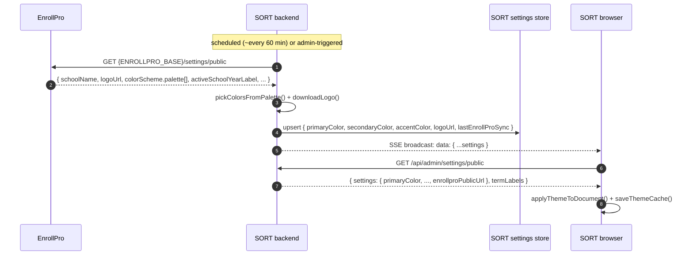

# SORT Branding Handoff — How SMART Fetches School Branding from EnrollPro

> [!IMPORTANT]
> **AI AGENTS: READ THIS WHOLE FILE BEFORE WRITING CODE.**
> Your system (SORT / MRF) is the only companion that does not yet have EnrollPro branding. This document is the implementation spec for that.
>
> - **You will build:** a server-side branding sync (EnrollPro → SORT), a public settings endpoint, an SSE channel, and a frontend theme provider.
> - **You will NOT build:** UI components. For the visual layer, read `SMART DESIGN HANDOFF TO ENROLLPRO, ATLAS, AIMS, and SORT.md` §3 and §4.
> - **Do not call EnrollPro from the browser.** All EnrollPro calls are server-to-server.
> - Before writing code, state your plan in one line: `Plan: SORT — branding sync (server) + theme provider (client)`.

---

## 1. What SORT Gets When This Is Done

| Capability | Result |
|---|---|
| School colors | SORT's UI uses the tenant's EnrollPro palette (`primary`, `secondary`, `accent`) instead of hardcoded colors |
| School logo | Downloaded from EnrollPro, served from SORT's own `/uploads` |
| School identity | `schoolName`, `schoolHeadName`, `activeSchoolYearLabel`, `depedEmail` shown in SORT chrome |
| Live updates | If the admin changes branding in EnrollPro, every open SORT tab re-themes within ~1 minute |
| Offline resilience | If EnrollPro is unreachable, SORT keeps the last successfully synced branding — never falls back to unthemed UI |
| Instant first paint | Cached theme applied before React renders (no flash of default color) |

---

## 2. Architecture (Two Tiers, Same as SMART)

```
EnrollPro (source of truth)
   │
   │  1. Server-to-server pull, unauthenticated:
   │     GET <ENROLLPRO_BASE>/settings/public
   ▼
SORT backend (Node/Express)
   │  2. Extract 3 colors from palette, download logo, upsert local settings row
   │  3. Broadcast to connected tabs over SSE
   ▼
SORT frontend (React)
   │  4. GET /api/admin/settings/public  (public, whitelisted)
   │  5. Cache in localStorage, apply CSS variables, update <title> + favicon
   │  6. Subscribe to /api/admin/settings/stream for live changes
   ▼
document.documentElement  →  every component re-themes via CSS variables
```

Why two tiers: EnrollPro must never be called directly by browser code (CORS, secret hygiene, and offline resilience all break). SORT stores the last-known branding locally and serves it from its own origin.



---

## 3. The EnrollPro Source Contract

### 3.1 Base URL resolution

SMART resolves the EnrollPro API base in this order (`server/src/lib/enrollproClient.ts:40-87`):

1. `SystemSettings.enrollproUrl` in the local DB (admin-configurable).
2. `ENROLLPRO_URL` environment variable.
3. `ENROLLPRO_BASE_URL` environment variable.
4. Hardcoded default: `https://dev-jegs.buru-degree.ts.net/api`.

Trailing slashes are stripped. **SORT should mirror this resolution order** so all systems point at the same hub. The public URL (for browser redirects, no `/api` suffix) is the same value with `/api` removed (`server/src/lib/companionSso.ts:68-77`).

### 3.2 The fetch call

`server/src/lib/enrollproClient.ts:994-1000`:

```ts
export async function getEnrollProPublicSettings(): Promise<EnrollProPublicSettings> {
  return fetchJSON(`${await getEnrollProBase()}/settings/public`) as Promise<EnrollProPublicSettings>;
}
```

- **Method/path:** `GET {ENROLLPRO_BASE}/settings/public`
- **Auth:** none. This endpoint is public. (Other EnrollPro integration endpoints need credentials — branding does not.)
- **TLS:** SMART's `fetchJSON` uses `rejectUnauthorized: false` to accept Tailscale `.ts.net` certs (`server/src/lib/enrollproClient.ts:106-126`). If SORT runs outside the tailnet, keep default TLS verification and use a valid cert instead.
- **Timeouts:** SMART's logo download uses a 20 s timeout (`server/src/lib/enrollproBrandingSync.ts:87-89`); apply a comparable timeout to the settings fetch in SORT.

### 3.3 Exact response shape (verified)

`server/src/lib/enrollproClient.ts:960-992`:

```ts
export interface EnrollProPaletteColor {
  hex: string;        // "#7f1d1d"
  hsl: string;        // "0 63% 29%"
  foreground: string;
}

export interface EnrollProPublicSettings {
  schoolName: string;
  schoolHeadName?: string;
  logoUrl: string | null;              // relative path, e.g. "/uploads/logo.png"
  colorScheme: {
    palette: EnrollProPaletteColor[];
    extracted_at?: string;
  } | null;
  selectedAccentHsl: string | null;
  activeSchoolYearId: number | null;
  activeSchoolYearLabel: string | null;
  activeSchoolYearStatus: string | null;
  depedEmail: string | null;
  facebookPageUrl: string | null;
  schoolWebsite: string | null;
  enrollmentPhase: string | null;
  systemStatus: string | null;
  classOpeningDate?: string | null;
  classEndDate?: string | null;
  terms?: Array<{ label: string; startDate: string; endDate: string }>;
}
```

Sample payload:

```json
{
  "schoolName": "Bagong Silang National High School",
  "schoolHeadName": "Juan Dela Cruz",
  "logoUrl": "/uploads/school-logo-1726.png",
  "colorScheme": {
    "palette": [
      { "hex": "#7f1d1d", "hsl": "0 63% 29%", "foreground": "#ffffff" },
      { "hex": "#991b1b", "hsl": "0 70% 35%", "foreground": "#ffffff" },
      { "hex": "#b91c1c", "hsl": "0 71% 42%", "foreground": "#ffffff" }
    ],
    "extracted_at": "2026-08-30T02:11:07.000Z"
  },
  "selectedAccentHsl": "0 71% 42%",
  "activeSchoolYearId": 1,
  "activeSchoolYearLabel": "2026-2027",
  "activeSchoolYearStatus": "ACTIVE",
  "depedEmail": "300123@deped.gov.ph",
  "classOpeningDate": "2026-06-01",
  "classEndDate": "2027-03-31"
}
```

> SMART intentionally ignores `selectedAccentHsl` and uses **hex values from `colorScheme.palette`** instead. Do the same so all systems pick identical colors.

---

## 4. Color Selection Rule (Copy This Exactly)

`server/src/lib/enrollproBrandingSync.ts:29-48`:

```ts
/** Pick 3 brand colors from an EnrollPro palette (skip near-white and near-black). */
export function pickColorsFromPalette(
  palette: Array<{ hex: string }>
): { primary: string; secondary: string; accent: string } {
  const vibrant = palette
    .filter((c) => {
      if (!c.hex || c.hex.length < 7) return false;
      const r = parseInt(c.hex.slice(1, 3), 16);
      const g = parseInt(c.hex.slice(3, 5), 16);
      const b = parseInt(c.hex.slice(5, 7), 16);
      const lum = 0.299 * r + 0.587 * g + 0.114 * b;
      return lum > 30 && lum < 210;
    })
    .map((c) => c.hex);
  return {
    primary: vibrant[0] ?? "#10b981",
    secondary: vibrant[1] ?? "#34d399",
    accent: vibrant[2] ?? "#6ee7b7",
  };
}
```

Rules baked in:

1. Reject malformed hex (`length < 7`).
2. Reject near-black (`lum <= 30`) and near-white (`lum >= 210`) so UI text stays readable.
3. Take the first three survivors in palette order: primary, secondary, accent.
4. If fewer than three survive, fill the remaining slots with `#10b981` / `#34d399` / `#6ee7b7` **individually** (not all-or-nothing).

---

## 5. Logo Handling

EnrollPro returns a **relative** logo path. SMART downloads it and serves it from its own origin (`server/src/lib/enrollproBrandingSync.ts:50-98`):

1. `baseHost = ENROLLPRO_BASE_URL.replace(/\/api$/, "")` — the origin, not the API base.
2. `imageUrl = baseHost + logoRelativePath` (e.g. `https://dev-jegs.../uploads/school-logo-1726.png`).
3. Stream-download to `<uploads>/logo-enrollpro-sync.<ext>` (extension from the source path, default `.png`).
4. Store the **local** path (`/uploads/logo-enrollpro-sync.png`) in the settings row.
5. On failure (timeout/HTTP error): log, keep the previous logo, and continue the rest of the sync — logo failure is never fatal.

Also mirror SMART's behavior: only overwrite `logoUrl` when the download succeeds (`enrollproBrandingSync.ts:132` — `if (logoUrl) updateData.logoUrl = logoUrl;`).

---

## 6. When to Sync

SMART's scheduling, to replicate in SORT (`server/src/lib/syncCoordinator.ts:38,371-389`):

| Trigger | Detail |
|---|---|
| Periodic | Every 12th sync cycle; cycles are ~5 minutes → **branding refresh about once per hour**. Configurable via `BRANDING_SYNC_EVERY_N_CYCLES` (default `12`). |
| Forced | `forceBranding: true` in the coordinator (used by admin "Sync now" flows). |
| On demand | Admin route: `POST /api/admin/settings/sync-enrollpro` (admin JWT required) (`server/src/routes/admin-sub/system.ts:811-839`). |
| Skipped when | EnrollPro is offline, or a school-year rollover is in progress. Branding is low-priority; never block other work on it. |
| After success | SMART upserts the settings row, then broadcasts over SSE so all connected tabs update immediately (`enrollproBrandingSync.ts:245-271`). |

SORT can run its own scheduler on the same cadence. If SORT has no scheduler yet, start with: sync on server boot + every 60 minutes + admin-triggered button.

---

## 7. What SORT Must Expose to Its Own Frontend

### 7.1 Public settings endpoint (whitelist only)

SMART exposes `GET /api/admin/settings/public` with **no auth** and a hard whitelist, rate-limit exempt (`server/src/routes/admin-sub/system.ts:111-151`, `server/src/middleware/rateLimiter.ts:18`):

```json
{
  "settings": {
    "schoolName": "...",
    "schoolId": "...",
    "division": "...",
    "region": "...",
    "schoolHeadName": "...",
    "address": "...",
    "primaryColor": "#7f1d1d",
    "secondaryColor": "#991b1b",
    "accentColor": "#b91c1c",
    "logoUrl": "/uploads/logo-enrollpro-sync.png",
    "currentSchoolYear": "2026-2027",
    "currentTerm": "T2",
    "termDatesDerived": false,
    "enrollproPublicUrl": "https://dev-jegs.buru-degree.ts.net"
  },
  "termLabels": { "T1": "Term 1", "T2": "Term 2", "T3": "Term 3" }
}
```

Rules:

- Never expose EnrollPro credentials (`enrollproPassword`, `enrollproIntegrationKey`) — SMART strips them in `sanitizeSettings()` (`server/src/routes/admin-sub/system.ts:39-46`). SORT must do equivalent stripping.
- Empty-database fallback: return at least `{ settings: { enrollproPublicUrl: "..." }, termLabels: {defaults} }` so the client always gets a usable response.
- Cache-control: this route is hit on every page load across all users; keep the DB read cheap (single row) and exempt it from aggressive rate limiting, exactly as SMART does.

### 7.2 SSE stream

`GET /api/admin/settings/stream?token=<JWT>` (`server/src/routes/admin-sub/system.ts:1006-1023`):

- `Content-Type: text/event-stream`, `Cache-Control: no-cache`, `Connection: keep-alive`, `X-Accel-Buffering: no`.
- `res.flushHeaders()` immediately.
- Heartbeat comment `: heartbeat` every 30 000 ms.
- Register the response in an in-memory client set; remove it on `req.on("close")`.
- Broadcast an unnamed frame `data: ${JSON.stringify(sanitizedSettings)}\n\n` to every client after a successful sync (`server/src/lib/sseManager.ts:47-56`).
- Auth: token may arrive as `?token=` query param because `EventSource` cannot set headers (`server/src/middleware/auth.ts:22-26` accepts header, query, or `accessToken` cookie).

---

## 8. Frontend Implementation (SORT)

### 8.1 Apply theme to the document (copy verbatim)

```ts
interface ThemeColors { primary: string; secondary: string; accent: string }

function isLightColor(hexColor: string): boolean {
  const hex = hexColor.replace("#", "");
  const r = parseInt(hex.substring(0, 2), 16);
  const g = parseInt(hex.substring(2, 4), 16);
  const b = parseInt(hex.substring(4, 6), 16);
  const luminance = (0.299 * r + 0.587 * g + 0.114 * b) / 255;
  return luminance > 0.5;
}

function adjustColor(hexColor: string, amount: number): string {
  const hex = hexColor.replace("#", "");
  const r = Math.min(255, Math.max(0, parseInt(hex.substring(0, 2), 16) + amount));
  const g = Math.min(255, Math.max(0, parseInt(hex.substring(2, 4), 16) + amount));
  const b = Math.min(255, Math.max(0, parseInt(hex.substring(4, 6), 16) + amount));
  return `#${r.toString(16).padStart(2, "0")}${g.toString(16).padStart(2, "0")}${b.toString(16).padStart(2, "0")}`;
}

function applyThemeToDocument(colors: ThemeColors) {
  const root = document.documentElement;

  // SORT/EnrollPro-compatible variables
  root.style.setProperty("--theme-primary", colors.primary);
  root.style.setProperty("--theme-secondary", colors.secondary);
  root.style.setProperty("--theme-accent", colors.accent);
  root.style.setProperty("--primary-color", colors.primary);
  root.style.setProperty("--secondary-color", colors.secondary);
  root.style.setProperty("--accent-color", colors.accent);
  root.style.setProperty("--text-color", isLightColor(colors.primary) ? "#1f2937" : "#ffffff");
  root.style.setProperty("--bg-color", "#f8fafc");

  // Variations
  root.style.setProperty("--theme-primary-light", adjustColor(colors.primary, 40));
  root.style.setProperty("--theme-primary-dark", adjustColor(colors.primary, -40));
  root.style.setProperty("--theme-secondary-light", adjustColor(colors.secondary, 40));
  root.style.setProperty("--theme-secondary-dark", adjustColor(colors.secondary, -40));
  root.style.setProperty("--primary-light", adjustColor(colors.primary, 40));
  root.style.setProperty("--primary-dark", adjustColor(colors.primary, -40));

  // Contrast-aware text colors
  const primaryTextColor = isLightColor(colors.primary) ? "#1f2937" : "#ffffff";
  const secondaryTextColor = isLightColor(colors.secondary) ? "#1f2937" : "#ffffff";
  root.style.setProperty("--theme-primary-text", primaryTextColor);
  root.style.setProperty("--theme-secondary-text", secondaryTextColor);
  root.style.setProperty("--text-primary", primaryTextColor);
  root.style.setProperty("--text-secondary", secondaryTextColor);
  root.style.setProperty("--on-primary", primaryTextColor);
  root.style.setProperty("--on-secondary", secondaryTextColor);

  // Tailwind semantic overrides
  root.style.setProperty("--primary", colors.primary);
  root.style.setProperty("--color-primary", colors.primary);
  root.style.setProperty("--primary-foreground", primaryTextColor);
  root.style.setProperty("--color-primary-foreground", primaryTextColor);
  root.style.setProperty("--ring", colors.primary);
  root.style.setProperty("--color-ring", colors.primary);

  // RGB decompositions (gradients / alpha)
  const hexToRgb = (hex: string) => {
    const h = hex.replace("#", "");
    return `${parseInt(h.substring(0, 2), 16)}, ${parseInt(h.substring(2, 4), 16)}, ${parseInt(h.substring(4, 6), 16)}`;
  };
  root.style.setProperty("--theme-primary-rgb", hexToRgb(colors.primary));
  root.style.setProperty("--theme-secondary-rgb", hexToRgb(colors.secondary));
  root.style.setProperty("--theme-accent-rgb", hexToRgb(colors.accent));
  root.style.setProperty("--primary-rgb", hexToRgb(colors.primary));
  root.style.setProperty("--chart-1", colors.primary);
}
```

Reference implementation: `src/contexts/ThemeContext.tsx:55-124`.

### 8.2 Metadata (title + favicon)

`src/contexts/ThemeContext.tsx:126-148`:

```ts
function updateBrowserMetadata(schoolName: string, logoUrl: string | null) {
  if (schoolName && schoolName !== "School Management System") {
    document.title = `${schoolName} | SORT`;          // SMART uses "| SMART" here
  } else {
    document.title = "SORT - School Operations System"; // SMART: "SMART - Academic Grading System"
  }
  if (logoUrl) {
    const fullLogoUrl = logoUrl.startsWith("http") ? logoUrl : `${window.location.origin}${logoUrl}`;
    let link: HTMLLinkElement | null = document.querySelector("link[rel*='icon']");
    if (!link) {
      link = document.createElement("link");
      link.rel = "icon";
      document.getElementsByTagName("head")[0].appendChild(link);
    }
    link.href = fullLogoUrl;
    link.type = "image/x-icon";
  }
}
```

### 8.3 Provider behavior (cache-first, network-update, SSE live)

Copy the pattern from `SMART DESIGN HANDOFF TO ENROLLPRO, ATLAS, AIMS, and SORT.md` §2.5 with these non-negotiables:

1. Initialize all state from `localStorage["smart_theme_cache"]` (or `sort_theme_cache` if you want isolation) inside `useState(() => ...)` so the first paint is branded.
2. Apply the cached theme in a mount effect **before** the network call.
3. `GET /api/admin/settings/public` with `withCredentials: true`; on success: set state → save cache → apply → update metadata.
4. On failure: re-apply the current/cached state; **never** revert to defaults while a cached theme exists.
5. Open `EventSource("/api/admin/settings/stream?token=" + encodeURIComponent(portalToken))`; `onmessage` → parse → apply → cache. Backoff 2 s doubling to 30 s, reset on `onopen`.
6. If there is no token yet (login pages), skip SSE — the HTTP fetch still themes the page.

Cache value shape (identical to SMART so tooling and docs stay compatible):

```ts
{
  colors: { primary: string; secondary: string; accent: string },
  logoUrl: string | null,
  schoolName: string,
  schoolAddress: string,
  schoolDivision: string,
  schoolRegion: string,
  schoolId: string,
  currentSchoolYear?: string
}
```

---

## 9. Failure Matrix (Must All Be Handled)

| Failure | Correct SORT behavior |
|---|---|
| EnrollPro unreachable during sync | Keep existing DB branding; log a warning; retry next cycle. Never blank the colors. |
| `colorScheme` null or palette empty | Use `#10b981` / `#34d399` / `#6ee7b7`. |
| Fewer than 3 vibrant colors | Fill only the missing slots with the defaults (per-slot fallback). |
| `logoUrl` null in EnrollPro | Keep the current logo; do not clear it. |
| Logo download fails/timeouts | Keep the current logo; sync the rest (colors, name) anyway. |
| `/api/admin/settings/public` fails in browser | Use `localStorage` cache; if no cache, defaults. |
| SSE disconnects | Exponential backoff reconnect; the HTTP fetch on next page load still updates branding. |
| Tenant primary is very light | `--primary-foreground` must become `#1f2937` (see `isLightColor`). Test this explicitly. |
| Admin clears branding in EnrollPro | Next sync writes defaults; cached browsers converge on the next fetch/SSE frame. |

---

## 10. Verification Checklist

Server:
- [ ] `GET {ENROLLPRO_BASE}/settings/public` returns 200 from the SORT server host (Tailscale cert handling if needed).
- [ ] Sync writes exactly three colors into the local settings row, with `lastEnrollProSync` timestamp.
- [ ] Logo is downloaded to SORT's own `/uploads` and the stored path is local.
- [ ] Killing EnrollPro connectivity leaves the previous branding intact and the sync exits non-fatally.
- [ ] `GET /api/admin/settings/public` never includes EnrollPro credentials.
- [ ] `POST`-style admin "sync now" endpoint (or equivalent) triggers a sync and writes an audit log.
- [ ] SSE endpoint emits `: heartbeat` every 30 s and a `data:` frame after each successful sync.

Client:
- [ ] First paint is branded with cached values (disable network after one visit to confirm).
- [ ] Changing the palette in EnrollPro re-themes an open SORT tab without reload (~1 min or on next broadcast).
- [ ] `<title>` becomes `"{schoolName} | SORT"` and the favicon becomes the school logo.
- [ ] With a light primary (e.g. `#f1f5f9`), button text renders `#1f2937`; with a dark primary, `#ffffff`.
- [ ] With no cache and the API down, defaults `#10b981/#34d399/#6ee7b7` render.
- [ ] Two different tenant brandings produce visibly different SORT UIs.
- [ ] No console errors when `logoUrl` is null or when SSE reconnects.

---

## 11. What NOT To Do

1. **Do not call EnrollPro from browser code.** The pull is server-to-server only.
2. **Do not write to EnrollPro.** Branding flows one way: EnrollPro → SORT. No callbacks, no update endpoints.
3. **Do not use `selectedAccentHsl` or the `hsl` fields** — use the palette `hex` values so all systems select identical colors.
4. **Do not inline the palette into your bundle** — colors must arrive at runtime from the settings endpoint.
5. **Do not expose EnrollPro credentials or the raw `EnrollProPublicSettings` payload.** Whitelist the public response.
6. **Do not blank branding on failure** — keep last-known values.
7. **Do not skip the cache** — without it every page load flashes the default green before the fetch resolves.
8. **Do not hardcode `| SMART`** in the title — use your own system name.

---

## 12. Reference Map (SMART Paths)

| Concern | File |
|---|---|
| EnrollPro client + `EnrollProPublicSettings` type + base URL resolution | `server/src/lib/enrollproClient.ts:40-135, 960-1000` |
| Branding sync (colors, logo, school fields) | `server/src/lib/enrollproBrandingSync.ts` (281 lines) |
| Sync scheduling / forced branding | `server/src/lib/syncCoordinator.ts:38, 371-389` |
| Admin on-demand sync route | `server/src/routes/admin-sub/system.ts:811-839` |
| Public settings endpoint | `server/src/routes/admin-sub/system.ts:111-151` |
| Settings SSE stream | `server/src/routes/admin-sub/system.ts:1006-1023` |
| SSE client registry / broadcast | `server/src/lib/sseManager.ts:47-56` |
| Token accepted via query for SSE | `server/src/middleware/auth.ts:22-26` |
| Frontend theme provider (reference implementation) | `src/contexts/ThemeContext.tsx` (329 lines) |
| Public settings consumption + defaults | `src/contexts/ThemeContext.tsx:5, 28-34, 191-237` |
| Visual layer (tokens, components, chrome) | `SMART DESIGN HANDOFF TO ENROLLPRO, ATLAS, AIMS, and SORT.md` §3, §4, §5.2 |

---

## Appendix — AI Agent Execution Protocol (obey before coding)

1. Identify the SORT codebase areas: Express server (sync job + routes), settings storage, SSE manager, React app (theme provider).
2. Print the plan line: `Plan: SORT — branding sync (server) + theme provider (client)`.
3. Implement server first: base URL resolution → fetch → `pickColorsFromPalette` → logo download → persist → SSE broadcast.
4. Implement the public endpoint with the whitelist above; verify no secrets leak.
5. Implement the SSE stream with 30 s heartbeats and cleanup on close.
6. Implement the frontend: cache-first provider, `applyThemeToDocument` verbatim, metadata update, SSE subscription with backoff.
7. Walk the Failure Matrix (§9) and confirm each row is handled in code.
8. Run the Verification Checklist (§10), then report: files changed, endpoints added, env vars required, and any deviations from this spec with reasons.
